# App 内存变化监控报告

| 项目 | 值 |
| --- | --- |
| 监控目标 | `firefox` |
| 监控时长 | `60 s` |
| 采样间隔 | `2 s` |
| 页大小 | `4096 bytes` |
| 进程数量 | `14` |

> 图中的数值单位都是 KiB。`RSS/PSS/Present` 反映真实驻留内存相关变化，`Size/NotPresent/Swap` 反映虚拟空间、未驻留页和换出页变化。

## PID 3985 `firefox`

- 命令行：`/snap/firefox/7766/usr/lib/firefox/firefox`
- 采样次数：`31`

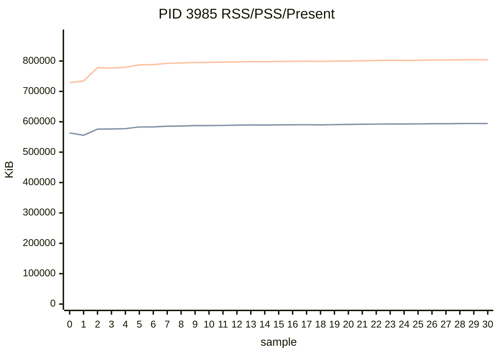
```mermaid
xychart-beta
    title "PID 3985 RSS/PSS/Present"
    x-axis "sample" ["0", "1", "2", "3", "4", "5", "6", "7", "8", "9", "10", "11", "12", "13", "14", "15", "16", "17", "18", "19", "20", "21", "22", "23", "24", "25", "26", "27", "28", "29", "30"]
    y-axis "KiB" 0 --> 884990
    line "RSS" [728752, 731768, 777340, 776388, 778192, 787692, 787980, 792284, 793508, 795684, 795396, 796044, 797272, 797976, 797476, 798276, 798712, 798928, 798316, 799320, 799824, 800936, 801424, 801808, 801520, 801780, 802804, 802688, 803768, 804076, 803632]
    line "PSS" [563348, 555480, 575725, 576381, 577393, 582930, 583172, 585426, 586007, 587573, 587531, 587928, 589038, 589434, 589288, 589754, 590074, 590253, 589921, 590537, 591267, 591927, 592331, 592652, 592645, 592905, 593541, 593580, 594166, 594368, 594258]
    line "Present" [728860, 734908, 778296, 776784, 779524, 787232, 788112, 792428, 793740, 795184, 795572, 796296, 796980, 798364, 797868, 798716, 799096, 799316, 798712, 799784, 800296, 800744, 801844, 802232, 801952, 802288, 803320, 803808, 804228, 804536, 804088]
```

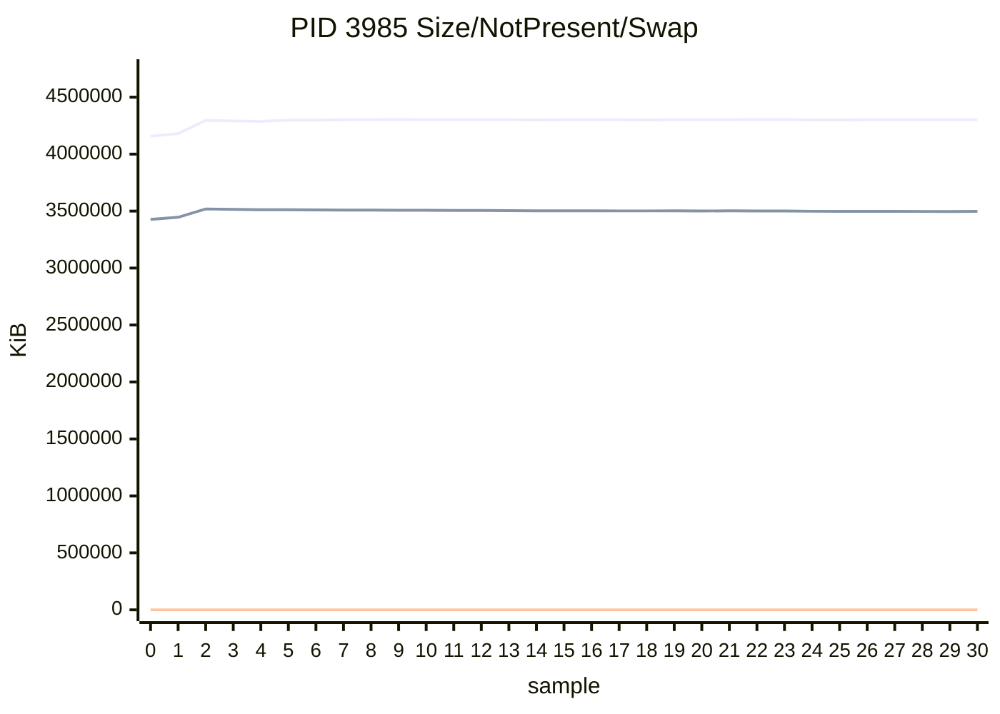
```mermaid
xychart-beta
    title "PID 3985 Size/NotPresent/Swap"
    x-axis "sample" ["0", "1", "2", "3", "4", "5", "6", "7", "8", "9", "10", "11", "12", "13", "14", "15", "16", "17", "18", "19", "20", "21", "22", "23", "24", "25", "26", "27", "28", "29", "30"]
    y-axis "KiB" 0 --> 4733226
    line "Size" [4156384, 4180744, 4297168, 4291384, 4287660, 4298864, 4298168, 4301472, 4302148, 4302848, 4302212, 4302228, 4302228, 4302212, 4300248, 4300944, 4300944, 4300944, 4300264, 4301952, 4301212, 4300876, 4302932, 4302932, 4300512, 4300512, 4301192, 4301192, 4301208, 4301224, 4301568]
    line "NotPresent" [3427524, 3445836, 3518872, 3514600, 3512236, 3511632, 3510056, 3509044, 3508412, 3507664, 3506644, 3505932, 3505248, 3503848, 3502380, 3502228, 3501848, 3501628, 3501552, 3502168, 3500916, 3502188, 3501088, 3500700, 3498560, 3498224, 3497872, 3497384, 3496980, 3496688, 3497480]
    line "Swap" [0, 0, 0, 0, 0, 0, 0, 0, 0, 0, 0, 0, 0, 0, 0, 0, 0, 0, 0, 0, 0, 0, 0, 0, 0, 0, 0, 0, 0, 0, 0]
```

| sample | Size | RSS | PSS | Present | NotPresent | Swap | 虚拟页 | Present页 | Swap页 |
| ---: | ---: | ---: | ---: | ---: | ---: | ---: | ---: | ---: | ---: |
| 0 | 4156384 | 728752 | 563348 | 728860 | 3427524 | 0 | 1039096 | 182215 | 0 |
| 1 | 4180744 | 731768 | 555480 | 734908 | 3445836 | 0 | 1045186 | 183727 | 0 |
| 2 | 4297168 | 777340 | 575725 | 778296 | 3518872 | 0 | 1074292 | 194574 | 0 |
| 3 | 4291384 | 776388 | 576381 | 776784 | 3514600 | 0 | 1072846 | 194196 | 0 |
| 4 | 4287660 | 778192 | 577393 | 779524 | 3512236 | 0 | 1072940 | 194881 | 0 |
| 5 | 4298864 | 787692 | 582930 | 787232 | 3511632 | 0 | 1074716 | 196808 | 0 |
| 6 | 4298168 | 787980 | 583172 | 788112 | 3510056 | 0 | 1074542 | 197028 | 0 |
| 7 | 4301472 | 792284 | 585426 | 792428 | 3509044 | 0 | 1075368 | 198107 | 0 |
| 8 | 4302148 | 793508 | 586007 | 793740 | 3508412 | 0 | 1075538 | 198435 | 0 |
| 9 | 4302848 | 795684 | 587573 | 795184 | 3507664 | 0 | 1075712 | 198796 | 0 |
| 10 | 4302212 | 795396 | 587531 | 795572 | 3506644 | 0 | 1075554 | 198893 | 0 |
| 11 | 4302228 | 796044 | 587928 | 796296 | 3505932 | 0 | 1075557 | 199074 | 0 |
| 12 | 4302228 | 797272 | 589038 | 796980 | 3505248 | 0 | 1075557 | 199245 | 0 |
| 13 | 4302212 | 797976 | 589434 | 798364 | 3503848 | 0 | 1075553 | 199591 | 0 |
| 14 | 4300248 | 797476 | 589288 | 797868 | 3502380 | 0 | 1075062 | 199467 | 0 |
| 15 | 4300944 | 798276 | 589754 | 798716 | 3502228 | 0 | 1075236 | 199679 | 0 |
| 16 | 4300944 | 798712 | 590074 | 799096 | 3501848 | 0 | 1075236 | 199774 | 0 |
| 17 | 4300944 | 798928 | 590253 | 799316 | 3501628 | 0 | 1075236 | 199829 | 0 |
| 18 | 4300264 | 798316 | 589921 | 798712 | 3501552 | 0 | 1075066 | 199678 | 0 |
| 19 | 4301952 | 799320 | 590537 | 799784 | 3502168 | 0 | 1075488 | 199946 | 0 |
| 20 | 4301212 | 799824 | 591267 | 800296 | 3500916 | 0 | 1075303 | 200074 | 0 |
| 21 | 4300876 | 800936 | 591927 | 800744 | 3502188 | 0 | 1075733 | 200186 | 0 |
| 22 | 4302932 | 801424 | 592331 | 801844 | 3501088 | 0 | 1075733 | 200461 | 0 |
| 23 | 4302932 | 801808 | 592652 | 802232 | 3500700 | 0 | 1075733 | 200558 | 0 |
| 24 | 4300512 | 801520 | 592645 | 801952 | 3498560 | 0 | 1075128 | 200488 | 0 |
| 25 | 4300512 | 801780 | 592905 | 802288 | 3498224 | 0 | 1075128 | 200572 | 0 |
| 26 | 4301192 | 802804 | 593541 | 803320 | 3497872 | 0 | 1075298 | 200830 | 0 |
| 27 | 4301192 | 802688 | 593580 | 803808 | 3497384 | 0 | 1075298 | 200952 | 0 |
| 28 | 4301208 | 803768 | 594166 | 804228 | 3496980 | 0 | 1075302 | 201057 | 0 |
| 29 | 4301224 | 804076 | 594368 | 804536 | 3496688 | 0 | 1075306 | 201134 | 0 |
| 30 | 4301568 | 803632 | 594258 | 804088 | 3497480 | 0 | 1075392 | 201022 | 0 |

## PID 4047 `crashhelper`

- 命令行：`/snap/firefox/7766/usr/lib/firefox/crashhelper 3985 9 /tmp/ 11`
- 采样次数：`31`

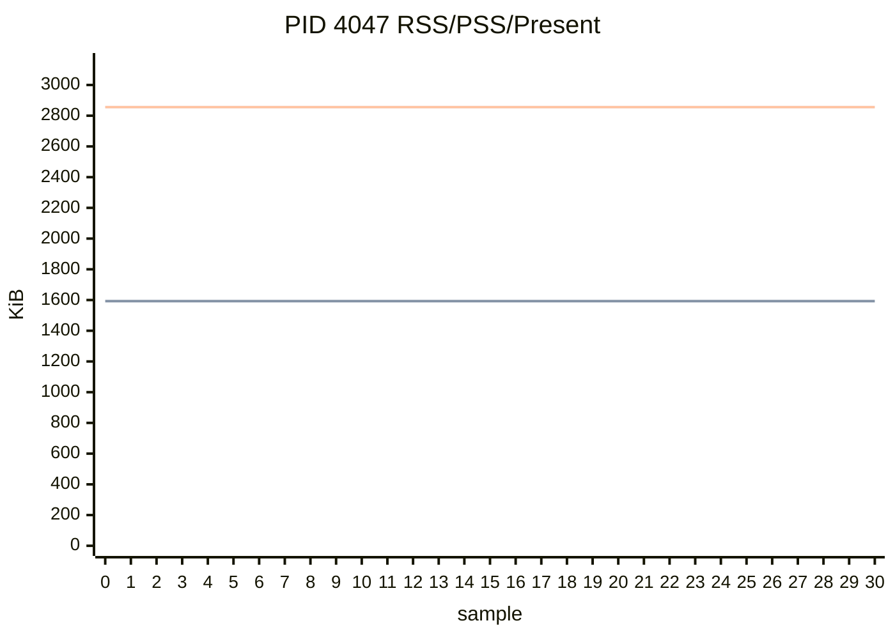
```mermaid
xychart-beta
    title "PID 4047 RSS/PSS/Present"
    x-axis "sample" ["0", "1", "2", "3", "4", "5", "6", "7", "8", "9", "10", "11", "12", "13", "14", "15", "16", "17", "18", "19", "20", "21", "22", "23", "24", "25", "26", "27", "28", "29", "30"]
    y-axis "KiB" 0 --> 3142
    line "RSS" [2856, 2856, 2856, 2856, 2856, 2856, 2856, 2856, 2856, 2856, 2856, 2856, 2856, 2856, 2856, 2856, 2856, 2856, 2856, 2856, 2856, 2856, 2856, 2856, 2856, 2856, 2856, 2856, 2856, 2856, 2856]
    line "PSS" [1593, 1593, 1593, 1593, 1593, 1593, 1593, 1593, 1593, 1593, 1593, 1593, 1593, 1593, 1593, 1593, 1593, 1593, 1593, 1593, 1593, 1593, 1593, 1593, 1593, 1593, 1593, 1593, 1593, 1593, 1593]
    line "Present" [2856, 2856, 2856, 2856, 2856, 2856, 2856, 2856, 2856, 2856, 2856, 2856, 2856, 2856, 2856, 2856, 2856, 2856, 2856, 2856, 2856, 2856, 2856, 2856, 2856, 2856, 2856, 2856, 2856, 2856, 2856]
```

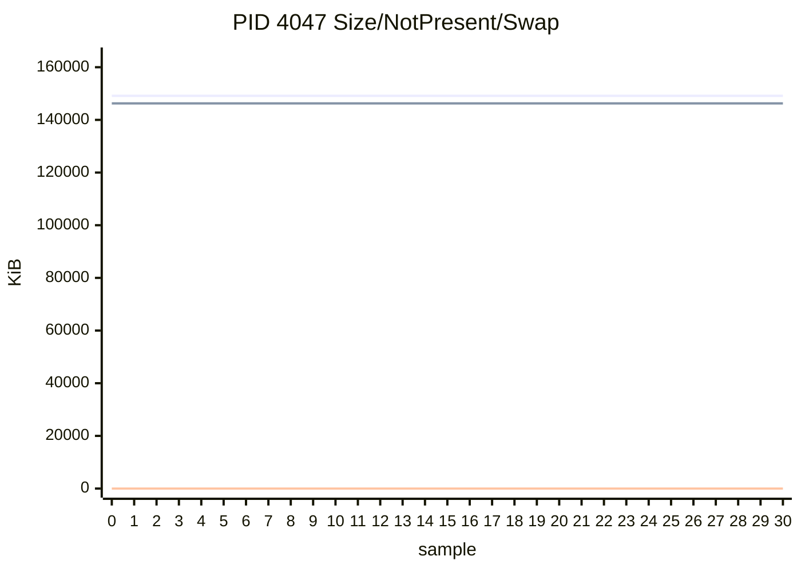
```mermaid
xychart-beta
    title "PID 4047 Size/NotPresent/Swap"
    x-axis "sample" ["0", "1", "2", "3", "4", "5", "6", "7", "8", "9", "10", "11", "12", "13", "14", "15", "16", "17", "18", "19", "20", "21", "22", "23", "24", "25", "26", "27", "28", "29", "30"]
    y-axis "KiB" 0 --> 164050
    line "Size" [149136, 149136, 149136, 149136, 149136, 149136, 149136, 149136, 149136, 149136, 149136, 149136, 149136, 149136, 149136, 149136, 149136, 149136, 149136, 149136, 149136, 149136, 149136, 149136, 149136, 149136, 149136, 149136, 149136, 149136, 149136]
    line "NotPresent" [146276, 146276, 146276, 146276, 146276, 146276, 146276, 146276, 146276, 146276, 146276, 146276, 146276, 146276, 146276, 146276, 146276, 146276, 146276, 146276, 146276, 146276, 146276, 146276, 146276, 146276, 146276, 146276, 146276, 146276, 146276]
    line "Swap" [0, 0, 0, 0, 0, 0, 0, 0, 0, 0, 0, 0, 0, 0, 0, 0, 0, 0, 0, 0, 0, 0, 0, 0, 0, 0, 0, 0, 0, 0, 0]
```

| sample | Size | RSS | PSS | Present | NotPresent | Swap | 虚拟页 | Present页 | Swap页 |
| ---: | ---: | ---: | ---: | ---: | ---: | ---: | ---: | ---: | ---: |
| 0 | 149136 | 2856 | 1593 | 2856 | 146276 | 0 | 37283 | 714 | 0 |
| 1 | 149136 | 2856 | 1593 | 2856 | 146276 | 0 | 37283 | 714 | 0 |
| 2 | 149136 | 2856 | 1593 | 2856 | 146276 | 0 | 37283 | 714 | 0 |
| 3 | 149136 | 2856 | 1593 | 2856 | 146276 | 0 | 37283 | 714 | 0 |
| 4 | 149136 | 2856 | 1593 | 2856 | 146276 | 0 | 37283 | 714 | 0 |
| 5 | 149136 | 2856 | 1593 | 2856 | 146276 | 0 | 37283 | 714 | 0 |
| 6 | 149136 | 2856 | 1593 | 2856 | 146276 | 0 | 37283 | 714 | 0 |
| 7 | 149136 | 2856 | 1593 | 2856 | 146276 | 0 | 37283 | 714 | 0 |
| 8 | 149136 | 2856 | 1593 | 2856 | 146276 | 0 | 37283 | 714 | 0 |
| 9 | 149136 | 2856 | 1593 | 2856 | 146276 | 0 | 37283 | 714 | 0 |
| 10 | 149136 | 2856 | 1593 | 2856 | 146276 | 0 | 37283 | 714 | 0 |
| 11 | 149136 | 2856 | 1593 | 2856 | 146276 | 0 | 37283 | 714 | 0 |
| 12 | 149136 | 2856 | 1593 | 2856 | 146276 | 0 | 37283 | 714 | 0 |
| 13 | 149136 | 2856 | 1593 | 2856 | 146276 | 0 | 37283 | 714 | 0 |
| 14 | 149136 | 2856 | 1593 | 2856 | 146276 | 0 | 37283 | 714 | 0 |
| 15 | 149136 | 2856 | 1593 | 2856 | 146276 | 0 | 37283 | 714 | 0 |
| 16 | 149136 | 2856 | 1593 | 2856 | 146276 | 0 | 37283 | 714 | 0 |
| 17 | 149136 | 2856 | 1593 | 2856 | 146276 | 0 | 37283 | 714 | 0 |
| 18 | 149136 | 2856 | 1593 | 2856 | 146276 | 0 | 37283 | 714 | 0 |
| 19 | 149136 | 2856 | 1593 | 2856 | 146276 | 0 | 37283 | 714 | 0 |
| 20 | 149136 | 2856 | 1593 | 2856 | 146276 | 0 | 37283 | 714 | 0 |
| 21 | 149136 | 2856 | 1593 | 2856 | 146276 | 0 | 37283 | 714 | 0 |
| 22 | 149136 | 2856 | 1593 | 2856 | 146276 | 0 | 37283 | 714 | 0 |
| 23 | 149136 | 2856 | 1593 | 2856 | 146276 | 0 | 37283 | 714 | 0 |
| 24 | 149136 | 2856 | 1593 | 2856 | 146276 | 0 | 37283 | 714 | 0 |
| 25 | 149136 | 2856 | 1593 | 2856 | 146276 | 0 | 37283 | 714 | 0 |
| 26 | 149136 | 2856 | 1593 | 2856 | 146276 | 0 | 37283 | 714 | 0 |
| 27 | 149136 | 2856 | 1593 | 2856 | 146276 | 0 | 37283 | 714 | 0 |
| 28 | 149136 | 2856 | 1593 | 2856 | 146276 | 0 | 37283 | 714 | 0 |
| 29 | 149136 | 2856 | 1593 | 2856 | 146276 | 0 | 37283 | 714 | 0 |
| 30 | 149136 | 2856 | 1593 | 2856 | 146276 | 0 | 37283 | 714 | 0 |

## PID 4275 `forkserver`

- 命令行：`/snap/firefox/7766/usr/lib/firefox/firefox -contentproc -ipcHandle 0 -signalPipe 1 -initialChannelId {d1e4a6d3-b4a5-45d7-9377-9b8c7badb1a1} -parentPid 3985 -greomni /snap/firefox/7766/usr/lib/firefox/omni.ja -appomni /snap/firefox/7766/usr/lib/firefox/browser/omni.ja -appDir /snap/firefox/7766/usr/lib/firefox/browser 1 forkserver`
- 采样次数：`31`

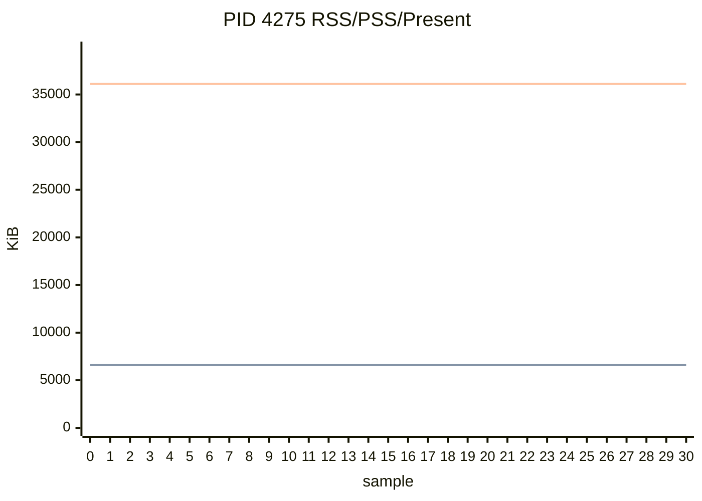
```mermaid
xychart-beta
    title "PID 4275 RSS/PSS/Present"
    x-axis "sample" ["0", "1", "2", "3", "4", "5", "6", "7", "8", "9", "10", "11", "12", "13", "14", "15", "16", "17", "18", "19", "20", "21", "22", "23", "24", "25", "26", "27", "28", "29", "30"]
    y-axis "KiB" 0 --> 39719
    line "RSS" [36108, 36108, 36108, 36108, 36108, 36108, 36108, 36108, 36108, 36108, 36108, 36108, 36108, 36108, 36108, 36108, 36108, 36108, 36108, 36108, 36108, 36108, 36108, 36108, 36108, 36108, 36108, 36108, 36108, 36108, 36108]
    line "PSS" [6593, 6593, 6595, 6595, 6595, 6595, 6595, 6595, 6595, 6595, 6595, 6595, 6595, 6595, 6595, 6595, 6595, 6595, 6595, 6595, 6595, 6595, 6595, 6595, 6595, 6595, 6595, 6595, 6595, 6595, 6595]
    line "Present" [36108, 36108, 36108, 36108, 36108, 36108, 36108, 36108, 36108, 36108, 36108, 36108, 36108, 36108, 36108, 36108, 36108, 36108, 36108, 36108, 36108, 36108, 36108, 36108, 36108, 36108, 36108, 36108, 36108, 36108, 36108]
```

```mermaid
xychart-beta
    title "PID 4275 Size/NotPresent/Swap"
    x-axis "sample" ["0", "1", "2", "3", "4", "5", "6", "7", "8", "9", "10", "11", "12", "13", "14", "15", "16", "17", "18", "19", "20", "21", "22", "23", "24", "25", "26", "27", "28", "29", "30"]
    y-axis "KiB" 0 --> 478430
    line "Size" [434936, 434936, 434936, 434936, 434936, 434936, 434936, 434936, 434936, 434936, 434936, 434936, 434936, 434936, 434936, 434936, 434936, 434936, 434936, 434936, 434936, 434936, 434936, 434936, 434936, 434936, 434936, 434936, 434936, 434936, 434936]
    line "NotPresent" [398824, 398824, 398824, 398824, 398824, 398824, 398824, 398824, 398824, 398824, 398824, 398824, 398824, 398824, 398824, 398824, 398824, 398824, 398824, 398824, 398824, 398824, 398824, 398824, 398824, 398824, 398824, 398824, 398824, 398824, 398824]
    line "Swap" [0, 0, 0, 0, 0, 0, 0, 0, 0, 0, 0, 0, 0, 0, 0, 0, 0, 0, 0, 0, 0, 0, 0, 0, 0, 0, 0, 0, 0, 0, 0]
```

| sample | Size | RSS | PSS | Present | NotPresent | Swap | 虚拟页 | Present页 | Swap页 |
| ---: | ---: | ---: | ---: | ---: | ---: | ---: | ---: | ---: | ---: |
| 0 | 434936 | 36108 | 6593 | 36108 | 398824 | 0 | 108733 | 9027 | 0 |
| 1 | 434936 | 36108 | 6593 | 36108 | 398824 | 0 | 108733 | 9027 | 0 |
| 2 | 434936 | 36108 | 6595 | 36108 | 398824 | 0 | 108733 | 9027 | 0 |
| 3 | 434936 | 36108 | 6595 | 36108 | 398824 | 0 | 108733 | 9027 | 0 |
| 4 | 434936 | 36108 | 6595 | 36108 | 398824 | 0 | 108733 | 9027 | 0 |
| 5 | 434936 | 36108 | 6595 | 36108 | 398824 | 0 | 108733 | 9027 | 0 |
| 6 | 434936 | 36108 | 6595 | 36108 | 398824 | 0 | 108733 | 9027 | 0 |
| 7 | 434936 | 36108 | 6595 | 36108 | 398824 | 0 | 108733 | 9027 | 0 |
| 8 | 434936 | 36108 | 6595 | 36108 | 398824 | 0 | 108733 | 9027 | 0 |
| 9 | 434936 | 36108 | 6595 | 36108 | 398824 | 0 | 108733 | 9027 | 0 |
| 10 | 434936 | 36108 | 6595 | 36108 | 398824 | 0 | 108733 | 9027 | 0 |
| 11 | 434936 | 36108 | 6595 | 36108 | 398824 | 0 | 108733 | 9027 | 0 |
| 12 | 434936 | 36108 | 6595 | 36108 | 398824 | 0 | 108733 | 9027 | 0 |
| 13 | 434936 | 36108 | 6595 | 36108 | 398824 | 0 | 108733 | 9027 | 0 |
| 14 | 434936 | 36108 | 6595 | 36108 | 398824 | 0 | 108733 | 9027 | 0 |
| 15 | 434936 | 36108 | 6595 | 36108 | 398824 | 0 | 108733 | 9027 | 0 |
| 16 | 434936 | 36108 | 6595 | 36108 | 398824 | 0 | 108733 | 9027 | 0 |
| 17 | 434936 | 36108 | 6595 | 36108 | 398824 | 0 | 108733 | 9027 | 0 |
| 18 | 434936 | 36108 | 6595 | 36108 | 398824 | 0 | 108733 | 9027 | 0 |
| 19 | 434936 | 36108 | 6595 | 36108 | 398824 | 0 | 108733 | 9027 | 0 |
| 20 | 434936 | 36108 | 6595 | 36108 | 398824 | 0 | 108733 | 9027 | 0 |
| 21 | 434936 | 36108 | 6595 | 36108 | 398824 | 0 | 108733 | 9027 | 0 |
| 22 | 434936 | 36108 | 6595 | 36108 | 398824 | 0 | 108733 | 9027 | 0 |
| 23 | 434936 | 36108 | 6595 | 36108 | 398824 | 0 | 108733 | 9027 | 0 |
| 24 | 434936 | 36108 | 6595 | 36108 | 398824 | 0 | 108733 | 9027 | 0 |
| 25 | 434936 | 36108 | 6595 | 36108 | 398824 | 0 | 108733 | 9027 | 0 |
| 26 | 434936 | 36108 | 6595 | 36108 | 398824 | 0 | 108733 | 9027 | 0 |
| 27 | 434936 | 36108 | 6595 | 36108 | 398824 | 0 | 108733 | 9027 | 0 |
| 28 | 434936 | 36108 | 6595 | 36108 | 398824 | 0 | 108733 | 9027 | 0 |
| 29 | 434936 | 36108 | 6595 | 36108 | 398824 | 0 | 108733 | 9027 | 0 |
| 30 | 434936 | 36108 | 6595 | 36108 | 398824 | 0 | 108733 | 9027 | 0 |

## PID 4290 `Socket Process`

- 命令行：`/snap/firefox/7766/usr/lib/firefox/firefox -contentproc -parentBuildID 20260204004611 -prefsHandle 0:36476 -prefMapHandle 1:276953 -sandboxReporter 2 -chrootClient 3 -ipcHandle 4 -initialChannelId {3e00c68f-835c-4dab-88e4-093288750d30} -parentPid 3985 -crashReporter 5 -crashHelper 6 -appDir /snap/firefox/7766/usr/lib/firefox/browser 2 socket`
- 采样次数：`31`

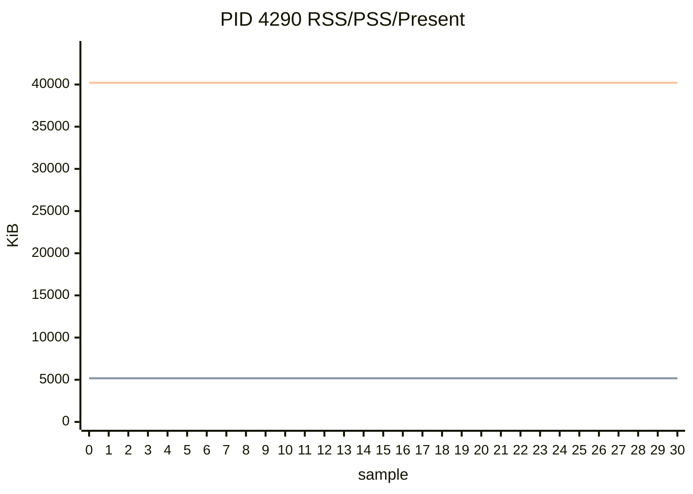
```mermaid
xychart-beta
    title "PID 4290 RSS/PSS/Present"
    x-axis "sample" ["0", "1", "2", "3", "4", "5", "6", "7", "8", "9", "10", "11", "12", "13", "14", "15", "16", "17", "18", "19", "20", "21", "22", "23", "24", "25", "26", "27", "28", "29", "30"]
    y-axis "KiB" 0 --> 44229
    line "RSS" [40208, 40208, 40208, 40208, 40208, 40208, 40208, 40208, 40208, 40208, 40208, 40208, 40208, 40208, 40208, 40208, 40208, 40208, 40208, 40208, 40208, 40208, 40208, 40208, 40208, 40208, 40208, 40208, 40208, 40208, 40208]
    line "PSS" [5175, 5175, 5175, 5175, 5175, 5175, 5175, 5175, 5175, 5175, 5175, 5175, 5175, 5175, 5175, 5175, 5175, 5175, 5175, 5175, 5175, 5175, 5175, 5175, 5175, 5175, 5175, 5175, 5175, 5175, 5175]
    line "Present" [40208, 40208, 40208, 40208, 40208, 40208, 40208, 40208, 40208, 40208, 40208, 40208, 40208, 40208, 40208, 40208, 40208, 40208, 40208, 40208, 40208, 40208, 40208, 40208, 40208, 40208, 40208, 40208, 40208, 40208, 40208]
```

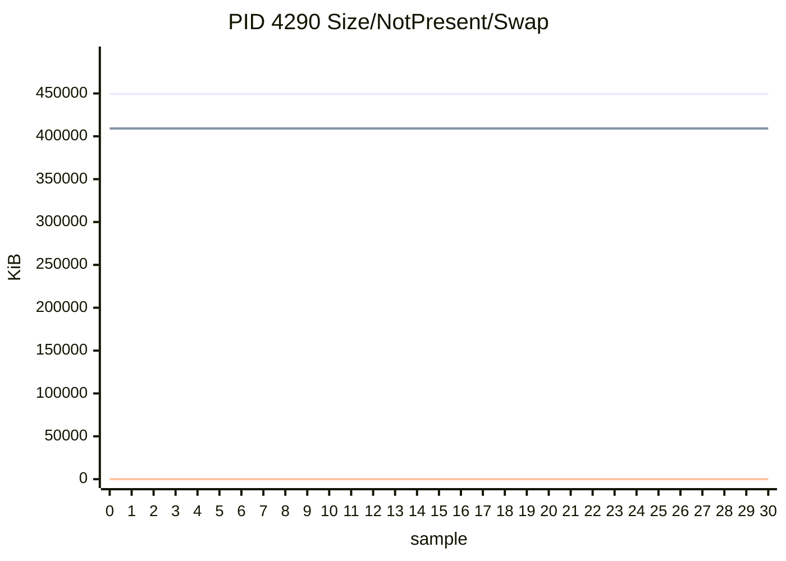
```mermaid
xychart-beta
    title "PID 4290 Size/NotPresent/Swap"
    x-axis "sample" ["0", "1", "2", "3", "4", "5", "6", "7", "8", "9", "10", "11", "12", "13", "14", "15", "16", "17", "18", "19", "20", "21", "22", "23", "24", "25", "26", "27", "28", "29", "30"]
    y-axis "KiB" 0 --> 494314
    line "Size" [449376, 449376, 449376, 449376, 449376, 449376, 449376, 449376, 449376, 449376, 449376, 449376, 449376, 449376, 449376, 449376, 449376, 449376, 449376, 449376, 449376, 449376, 449376, 449376, 449376, 449376, 449376, 449376, 449376, 449376, 449376]
    line "NotPresent" [409164, 409164, 409164, 409164, 409164, 409164, 409164, 409164, 409164, 409164, 409164, 409164, 409164, 409164, 409164, 409164, 409164, 409164, 409164, 409164, 409164, 409164, 409164, 409164, 409164, 409164, 409164, 409164, 409164, 409164, 409164]
    line "Swap" [0, 0, 0, 0, 0, 0, 0, 0, 0, 0, 0, 0, 0, 0, 0, 0, 0, 0, 0, 0, 0, 0, 0, 0, 0, 0, 0, 0, 0, 0, 0]
```

| sample | Size | RSS | PSS | Present | NotPresent | Swap | 虚拟页 | Present页 | Swap页 |
| ---: | ---: | ---: | ---: | ---: | ---: | ---: | ---: | ---: | ---: |
| 0 | 449376 | 40208 | 5175 | 40208 | 409164 | 0 | 112343 | 10052 | 0 |
| 1 | 449376 | 40208 | 5175 | 40208 | 409164 | 0 | 112343 | 10052 | 0 |
| 2 | 449376 | 40208 | 5175 | 40208 | 409164 | 0 | 112343 | 10052 | 0 |
| 3 | 449376 | 40208 | 5175 | 40208 | 409164 | 0 | 112343 | 10052 | 0 |
| 4 | 449376 | 40208 | 5175 | 40208 | 409164 | 0 | 112343 | 10052 | 0 |
| 5 | 449376 | 40208 | 5175 | 40208 | 409164 | 0 | 112343 | 10052 | 0 |
| 6 | 449376 | 40208 | 5175 | 40208 | 409164 | 0 | 112343 | 10052 | 0 |
| 7 | 449376 | 40208 | 5175 | 40208 | 409164 | 0 | 112343 | 10052 | 0 |
| 8 | 449376 | 40208 | 5175 | 40208 | 409164 | 0 | 112343 | 10052 | 0 |
| 9 | 449376 | 40208 | 5175 | 40208 | 409164 | 0 | 112343 | 10052 | 0 |
| 10 | 449376 | 40208 | 5175 | 40208 | 409164 | 0 | 112343 | 10052 | 0 |
| 11 | 449376 | 40208 | 5175 | 40208 | 409164 | 0 | 112343 | 10052 | 0 |
| 12 | 449376 | 40208 | 5175 | 40208 | 409164 | 0 | 112343 | 10052 | 0 |
| 13 | 449376 | 40208 | 5175 | 40208 | 409164 | 0 | 112343 | 10052 | 0 |
| 14 | 449376 | 40208 | 5175 | 40208 | 409164 | 0 | 112343 | 10052 | 0 |
| 15 | 449376 | 40208 | 5175 | 40208 | 409164 | 0 | 112343 | 10052 | 0 |
| 16 | 449376 | 40208 | 5175 | 40208 | 409164 | 0 | 112343 | 10052 | 0 |
| 17 | 449376 | 40208 | 5175 | 40208 | 409164 | 0 | 112343 | 10052 | 0 |
| 18 | 449376 | 40208 | 5175 | 40208 | 409164 | 0 | 112343 | 10052 | 0 |
| 19 | 449376 | 40208 | 5175 | 40208 | 409164 | 0 | 112343 | 10052 | 0 |
| 20 | 449376 | 40208 | 5175 | 40208 | 409164 | 0 | 112343 | 10052 | 0 |
| 21 | 449376 | 40208 | 5175 | 40208 | 409164 | 0 | 112343 | 10052 | 0 |
| 22 | 449376 | 40208 | 5175 | 40208 | 409164 | 0 | 112343 | 10052 | 0 |
| 23 | 449376 | 40208 | 5175 | 40208 | 409164 | 0 | 112343 | 10052 | 0 |
| 24 | 449376 | 40208 | 5175 | 40208 | 409164 | 0 | 112343 | 10052 | 0 |
| 25 | 449376 | 40208 | 5175 | 40208 | 409164 | 0 | 112343 | 10052 | 0 |
| 26 | 449376 | 40208 | 5175 | 40208 | 409164 | 0 | 112343 | 10052 | 0 |
| 27 | 449376 | 40208 | 5175 | 40208 | 409164 | 0 | 112343 | 10052 | 0 |
| 28 | 449376 | 40208 | 5175 | 40208 | 409164 | 0 | 112343 | 10052 | 0 |
| 29 | 449376 | 40208 | 5175 | 40208 | 409164 | 0 | 112343 | 10052 | 0 |
| 30 | 449376 | 40208 | 5175 | 40208 | 409164 | 0 | 112343 | 10052 | 0 |

## PID 4332 `Privileged Cont`

- 命令行：`/snap/firefox/7766/usr/lib/firefox/firefox -contentproc -isForBrowser -prefsHandle 0:36632 -prefMapHandle 1:276953 -jsInitHandle 2:223968 -parentBuildID 20260204004611 -sandboxReporter 3 -chrootClient 4 -ipcHandle 5 -initialChannelId {cf06a20a-76ad-4484-96b7-cbc4dcfddd41} -parentPid 3985 -crashReporter 6 -crashHelper 7 -greomni /snap/firefox/7766/usr/lib/firefox/omni.ja -appomni /snap/firefox/7766/usr/lib/firefox/browser/omni.ja -appDir /snap/firefox/7766/usr/lib/firefox/browser 3 tab`
- 采样次数：`31`

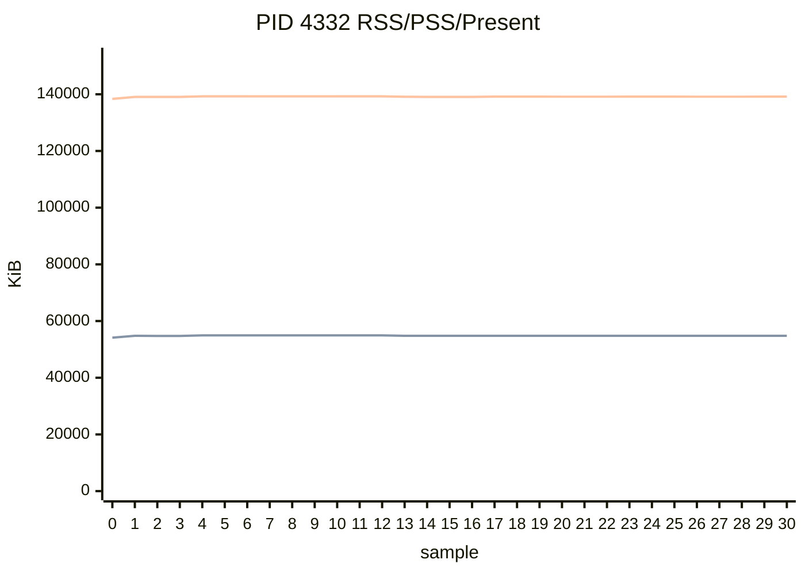
```mermaid
xychart-beta
    title "PID 4332 RSS/PSS/Present"
    x-axis "sample" ["0", "1", "2", "3", "4", "5", "6", "7", "8", "9", "10", "11", "12", "13", "14", "15", "16", "17", "18", "19", "20", "21", "22", "23", "24", "25", "26", "27", "28", "29", "30"]
    y-axis "KiB" 0 --> 153204
    line "RSS" [138356, 139024, 139024, 139024, 139224, 139224, 139224, 139208, 139208, 139208, 139224, 139224, 139224, 139056, 139040, 139040, 139040, 139120, 139120, 139120, 139104, 139104, 139104, 139120, 139120, 139120, 139104, 139104, 139104, 139120, 139120]
    line "PSS" [54147, 54781, 54759, 54759, 54958, 54958, 54958, 54942, 54942, 54942, 54958, 54958, 54958, 54790, 54774, 54774, 54774, 54806, 54806, 54806, 54790, 54790, 54790, 54806, 54806, 54806, 54790, 54790, 54790, 54806, 54806]
    line "Present" [138356, 139076, 139076, 139076, 139276, 139276, 139276, 139260, 139260, 139260, 139276, 139276, 139276, 139108, 139092, 139092, 139092, 139172, 139172, 139172, 139156, 139156, 139156, 139172, 139172, 139172, 139156, 139156, 139156, 139172, 139172]
```

```mermaid
xychart-beta
    title "PID 4332 Size/NotPresent/Swap"
    x-axis "sample" ["0", "1", "2", "3", "4", "5", "6", "7", "8", "9", "10", "11", "12", "13", "14", "15", "16", "17", "18", "19", "20", "21", "22", "23", "24", "25", "26", "27", "28", "29", "30"]
    y-axis "KiB" 0 --> 2939597
    line "Size" [2672360, 2672152, 2672152, 2672152, 2672168, 2672168, 2672168, 2672152, 2672152, 2672152, 2672168, 2672168, 2672168, 2672000, 2671984, 2671984, 2671984, 2672000, 2672000, 2672000, 2671984, 2671984, 2671984, 2672000, 2672000, 2672000, 2671984, 2671984, 2671984, 2672000, 2672000]
    line "NotPresent" [2534512, 2533776, 2533776, 2533776, 2533592, 2533592, 2533592, 2533592, 2533592, 2533592, 2533592, 2533592, 2533592, 2533592, 2533592, 2533592, 2533592, 2533528, 2533528, 2533528, 2533528, 2533528, 2533528, 2533528, 2533528, 2533528, 2533528, 2533528, 2533528, 2533528, 2533528]
    line "Swap" [0, 0, 0, 0, 0, 0, 0, 0, 0, 0, 0, 0, 0, 0, 0, 0, 0, 0, 0, 0, 0, 0, 0, 0, 0, 0, 0, 0, 0, 0, 0]
```

| sample | Size | RSS | PSS | Present | NotPresent | Swap | 虚拟页 | Present页 | Swap页 |
| ---: | ---: | ---: | ---: | ---: | ---: | ---: | ---: | ---: | ---: |
| 0 | 2672360 | 138356 | 54147 | 138356 | 2534512 | 0 | 668217 | 34589 | 0 |
| 1 | 2672152 | 139024 | 54781 | 139076 | 2533776 | 0 | 668213 | 34769 | 0 |
| 2 | 2672152 | 139024 | 54759 | 139076 | 2533776 | 0 | 668213 | 34769 | 0 |
| 3 | 2672152 | 139024 | 54759 | 139076 | 2533776 | 0 | 668213 | 34769 | 0 |
| 4 | 2672168 | 139224 | 54958 | 139276 | 2533592 | 0 | 668217 | 34819 | 0 |
| 5 | 2672168 | 139224 | 54958 | 139276 | 2533592 | 0 | 668217 | 34819 | 0 |
| 6 | 2672168 | 139224 | 54958 | 139276 | 2533592 | 0 | 668217 | 34819 | 0 |
| 7 | 2672152 | 139208 | 54942 | 139260 | 2533592 | 0 | 668213 | 34815 | 0 |
| 8 | 2672152 | 139208 | 54942 | 139260 | 2533592 | 0 | 668213 | 34815 | 0 |
| 9 | 2672152 | 139208 | 54942 | 139260 | 2533592 | 0 | 668213 | 34815 | 0 |
| 10 | 2672168 | 139224 | 54958 | 139276 | 2533592 | 0 | 668217 | 34819 | 0 |
| 11 | 2672168 | 139224 | 54958 | 139276 | 2533592 | 0 | 668217 | 34819 | 0 |
| 12 | 2672168 | 139224 | 54958 | 139276 | 2533592 | 0 | 668217 | 34819 | 0 |
| 13 | 2672000 | 139056 | 54790 | 139108 | 2533592 | 0 | 668175 | 34777 | 0 |
| 14 | 2671984 | 139040 | 54774 | 139092 | 2533592 | 0 | 668171 | 34773 | 0 |
| 15 | 2671984 | 139040 | 54774 | 139092 | 2533592 | 0 | 668171 | 34773 | 0 |
| 16 | 2671984 | 139040 | 54774 | 139092 | 2533592 | 0 | 668171 | 34773 | 0 |
| 17 | 2672000 | 139120 | 54806 | 139172 | 2533528 | 0 | 668175 | 34793 | 0 |
| 18 | 2672000 | 139120 | 54806 | 139172 | 2533528 | 0 | 668175 | 34793 | 0 |
| 19 | 2672000 | 139120 | 54806 | 139172 | 2533528 | 0 | 668175 | 34793 | 0 |
| 20 | 2671984 | 139104 | 54790 | 139156 | 2533528 | 0 | 668171 | 34789 | 0 |
| 21 | 2671984 | 139104 | 54790 | 139156 | 2533528 | 0 | 668171 | 34789 | 0 |
| 22 | 2671984 | 139104 | 54790 | 139156 | 2533528 | 0 | 668171 | 34789 | 0 |
| 23 | 2672000 | 139120 | 54806 | 139172 | 2533528 | 0 | 668175 | 34793 | 0 |
| 24 | 2672000 | 139120 | 54806 | 139172 | 2533528 | 0 | 668175 | 34793 | 0 |
| 25 | 2672000 | 139120 | 54806 | 139172 | 2533528 | 0 | 668175 | 34793 | 0 |
| 26 | 2671984 | 139104 | 54790 | 139156 | 2533528 | 0 | 668171 | 34789 | 0 |
| 27 | 2671984 | 139104 | 54790 | 139156 | 2533528 | 0 | 668171 | 34789 | 0 |
| 28 | 2671984 | 139104 | 54790 | 139156 | 2533528 | 0 | 668171 | 34789 | 0 |
| 29 | 2672000 | 139120 | 54806 | 139172 | 2533528 | 0 | 668175 | 34793 | 0 |
| 30 | 2672000 | 139120 | 54806 | 139172 | 2533528 | 0 | 668175 | 34793 | 0 |

## PID 4347 `RDD Process`

- 命令行：`/snap/firefox/7766/usr/lib/firefox/firefox -contentproc -parentBuildID 20260204004611 -prefsHandle 0:36632 -prefMapHandle 1:276953 -sandboxReporter 2 -chrootClient 3 -ipcHandle 4 -initialChannelId {106224d7-932e-40af-876c-dd044aa5ee67} -parentPid 3985 -crashReporter 5 -crashHelper 6 -appDir /snap/firefox/7766/usr/lib/firefox/browser 4 rdd`
- 采样次数：`31`

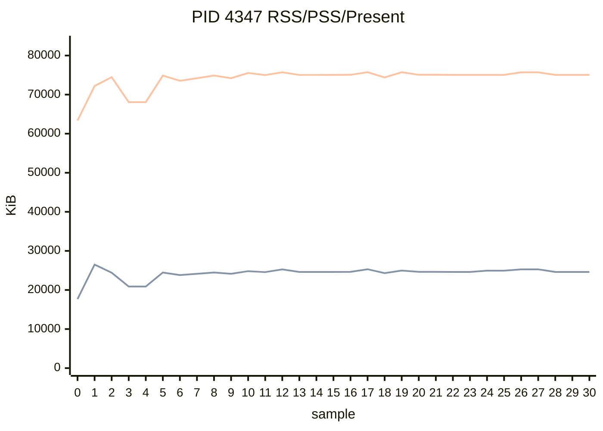
```mermaid
xychart-beta
    title "PID 4347 RSS/PSS/Present"
    x-axis "sample" ["0", "1", "2", "3", "4", "5", "6", "7", "8", "9", "10", "11", "12", "13", "14", "15", "16", "17", "18", "19", "20", "21", "22", "23", "24", "25", "26", "27", "28", "29", "30"]
    y-axis "KiB" 0 --> 83306
    line "RSS" [63360, 72192, 74464, 68068, 68068, 74864, 73528, 74196, 74872, 74204, 75540, 74984, 75700, 75032, 75032, 75040, 75064, 75732, 74396, 75732, 75064, 75064, 75040, 75040, 75040, 75040, 75708, 75708, 75040, 75040, 75040]
    line "PSS" [17680, 26500, 24424, 20896, 20896, 24474, 23806, 24140, 24478, 24144, 24812, 24570, 25274, 24606, 24606, 24614, 24638, 25306, 24304, 24972, 24638, 24638, 24614, 24614, 24948, 24948, 25282, 25282, 24614, 24614, 24614]
    line "Present" [63360, 72200, 74464, 68068, 68068, 74864, 73528, 74196, 74872, 74204, 75540, 74984, 75700, 75032, 75032, 75040, 75064, 75732, 74396, 75732, 75064, 75064, 75040, 75040, 75040, 75040, 75708, 75708, 75040, 75040, 75040]
```

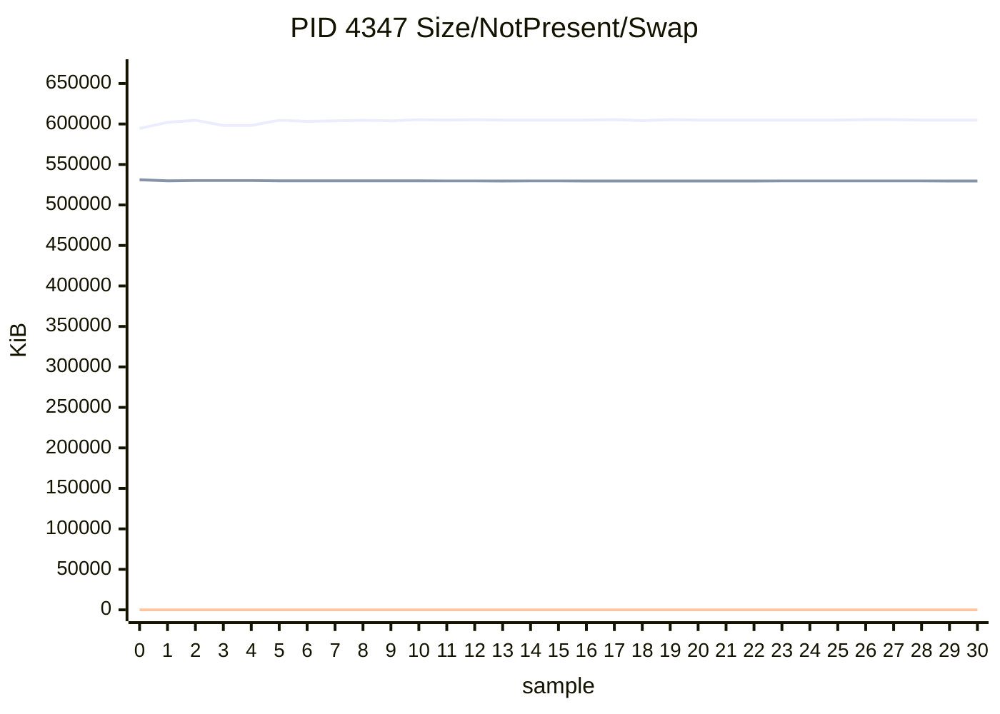
```mermaid
xychart-beta
    title "PID 4347 Size/NotPresent/Swap"
    x-axis "sample" ["0", "1", "2", "3", "4", "5", "6", "7", "8", "9", "10", "11", "12", "13", "14", "15", "16", "17", "18", "19", "20", "21", "22", "23", "24", "25", "26", "27", "28", "29", "30"]
    y-axis "KiB" 0 --> 665949
    line "Size" [594484, 602036, 604624, 598220, 598220, 604640, 603280, 603960, 604648, 603968, 605328, 604688, 605392, 604712, 604728, 604728, 604728, 605408, 604048, 605408, 604728, 604728, 604712, 604728, 604728, 604728, 605408, 605408, 604728, 604712, 604712]
    line "NotPresent" [531120, 529832, 530156, 530148, 530148, 529772, 529748, 529760, 529772, 529760, 529784, 529700, 529688, 529676, 529692, 529684, 529660, 529672, 529648, 529672, 529660, 529660, 529668, 529684, 529684, 529684, 529696, 529696, 529684, 529668, 529668]
    line "Swap" [0, 0, 0, 0, 0, 0, 0, 0, 0, 0, 0, 0, 0, 0, 0, 0, 0, 0, 0, 0, 0, 0, 0, 0, 0, 0, 0, 0, 0, 0, 0]
```

| sample | Size | RSS | PSS | Present | NotPresent | Swap | 虚拟页 | Present页 | Swap页 |
| ---: | ---: | ---: | ---: | ---: | ---: | ---: | ---: | ---: | ---: |
| 0 | 594484 | 63360 | 17680 | 63360 | 531120 | 0 | 148620 | 15840 | 0 |
| 1 | 602036 | 72192 | 26500 | 72200 | 529832 | 0 | 150508 | 18050 | 0 |
| 2 | 604624 | 74464 | 24424 | 74464 | 530156 | 0 | 151155 | 18616 | 0 |
| 3 | 598220 | 68068 | 20896 | 68068 | 530148 | 0 | 149554 | 17017 | 0 |
| 4 | 598220 | 68068 | 20896 | 68068 | 530148 | 0 | 149554 | 17017 | 0 |
| 5 | 604640 | 74864 | 24474 | 74864 | 529772 | 0 | 151159 | 18716 | 0 |
| 6 | 603280 | 73528 | 23806 | 73528 | 529748 | 0 | 150819 | 18382 | 0 |
| 7 | 603960 | 74196 | 24140 | 74196 | 529760 | 0 | 150989 | 18549 | 0 |
| 8 | 604648 | 74872 | 24478 | 74872 | 529772 | 0 | 151161 | 18718 | 0 |
| 9 | 603968 | 74204 | 24144 | 74204 | 529760 | 0 | 150991 | 18551 | 0 |
| 10 | 605328 | 75540 | 24812 | 75540 | 529784 | 0 | 151331 | 18885 | 0 |
| 11 | 604688 | 74984 | 24570 | 74984 | 529700 | 0 | 151171 | 18746 | 0 |
| 12 | 605392 | 75700 | 25274 | 75700 | 529688 | 0 | 151347 | 18925 | 0 |
| 13 | 604712 | 75032 | 24606 | 75032 | 529676 | 0 | 151177 | 18758 | 0 |
| 14 | 604728 | 75032 | 24606 | 75032 | 529692 | 0 | 151181 | 18758 | 0 |
| 15 | 604728 | 75040 | 24614 | 75040 | 529684 | 0 | 151181 | 18760 | 0 |
| 16 | 604728 | 75064 | 24638 | 75064 | 529660 | 0 | 151181 | 18766 | 0 |
| 17 | 605408 | 75732 | 25306 | 75732 | 529672 | 0 | 151351 | 18933 | 0 |
| 18 | 604048 | 74396 | 24304 | 74396 | 529648 | 0 | 151011 | 18599 | 0 |
| 19 | 605408 | 75732 | 24972 | 75732 | 529672 | 0 | 151351 | 18933 | 0 |
| 20 | 604728 | 75064 | 24638 | 75064 | 529660 | 0 | 151181 | 18766 | 0 |
| 21 | 604728 | 75064 | 24638 | 75064 | 529660 | 0 | 151181 | 18766 | 0 |
| 22 | 604712 | 75040 | 24614 | 75040 | 529668 | 0 | 151177 | 18760 | 0 |
| 23 | 604728 | 75040 | 24614 | 75040 | 529684 | 0 | 151181 | 18760 | 0 |
| 24 | 604728 | 75040 | 24948 | 75040 | 529684 | 0 | 151181 | 18760 | 0 |
| 25 | 604728 | 75040 | 24948 | 75040 | 529684 | 0 | 151181 | 18760 | 0 |
| 26 | 605408 | 75708 | 25282 | 75708 | 529696 | 0 | 151351 | 18927 | 0 |
| 27 | 605408 | 75708 | 25282 | 75708 | 529696 | 0 | 151351 | 18927 | 0 |
| 28 | 604728 | 75040 | 24614 | 75040 | 529684 | 0 | 151181 | 18760 | 0 |
| 29 | 604712 | 75040 | 24614 | 75040 | 529668 | 0 | 151177 | 18760 | 0 |
| 30 | 604712 | 75040 | 24614 | 75040 | 529668 | 0 | 151177 | 18760 | 0 |

## PID 4374 `Isolated Web Co`

- 命令行：`/snap/firefox/7766/usr/lib/firefox/firefox -contentproc -isForBrowser -prefsHandle 0:32015 -prefMapHandle 1:276953 -jsInitHandle 2:223968 -parentBuildID 20260204004611 -sandboxReporter 3 -chrootClient 4 -ipcHandle 5 -initialChannelId {b25af01c-61d7-4833-a9ab-ad36eef08569} -parentPid 3985 -crashReporter 6 -crashHelper 7 -greomni /snap/firefox/7766/usr/lib/firefox/omni.ja -appomni /snap/firefox/7766/usr/lib/firefox/browser/omni.ja -appDir /snap/firefox/7766/usr/lib/firefox/browser 5 tab`
- 采样次数：`31`

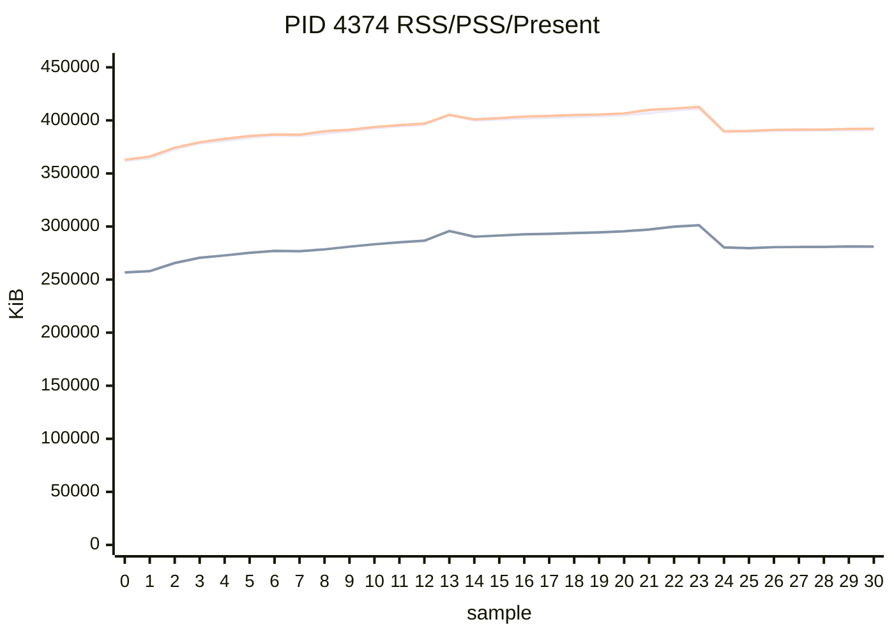
```mermaid
xychart-beta
    title "PID 4374 RSS/PSS/Present"
    x-axis "sample" ["0", "1", "2", "3", "4", "5", "6", "7", "8", "9", "10", "11", "12", "13", "14", "15", "16", "17", "18", "19", "20", "21", "22", "23", "24", "25", "26", "27", "28", "29", "30"]
    y-axis "KiB" 0 --> 453993
    line "RSS" [362060, 364036, 372740, 378296, 380700, 383544, 385628, 385440, 387288, 389960, 392312, 394336, 395892, 405108, 399668, 400796, 401956, 402552, 403312, 403952, 404892, 406728, 409424, 410740, 389872, 389196, 390192, 390376, 390456, 390956, 390780]
    line "PSS" [256697, 257900, 265597, 270530, 272758, 275269, 277057, 276772, 278446, 281019, 283277, 285195, 286622, 295749, 290391, 291519, 292605, 293164, 293913, 294500, 295459, 297188, 299872, 301188, 280309, 279622, 280572, 280724, 280772, 281251, 281075]
    line "Present" [362768, 365920, 374196, 379284, 382508, 385176, 386708, 386468, 389768, 391068, 393720, 395496, 396924, 405136, 400904, 402104, 403544, 404216, 405044, 405488, 406500, 409924, 411156, 412720, 389656, 390008, 391020, 391196, 391312, 391928, 392112]
```

```mermaid
xychart-beta
    title "PID 4374 Size/NotPresent/Swap"
    x-axis "sample" ["0", "1", "2", "3", "4", "5", "6", "7", "8", "9", "10", "11", "12", "13", "14", "15", "16", "17", "18", "19", "20", "21", "22", "23", "24", "25", "26", "27", "28", "29", "30"]
    y-axis "KiB" 0 --> 8032693
    line "Size" [7290720, 7291320, 7298520, 7298732, 7298864, 7299004, 7299052, 7299052, 7299044, 7299140, 7299264, 7299428, 7299440, 7302448, 7301228, 7301244, 7301244, 7301180, 7301116, 7301096, 7301040, 7301040, 7301056, 7301056, 7293296, 7293488, 7294640, 7294704, 7294720, 7295040, 7294784]
    line "NotPresent" [6933388, 6930456, 6929056, 6923988, 6920768, 6918112, 6916564, 6916804, 6913496, 6912228, 6909636, 6907900, 6906480, 6901340, 6904288, 6903104, 6901664, 6900992, 6900164, 6899704, 6898632, 6895208, 6893992, 6892428, 6909524, 6909172, 6909184, 6909008, 6908908, 6908292, 6908108]
    line "Swap" [0, 0, 0, 0, 0, 0, 0, 0, 0, 0, 0, 0, 0, 0, 0, 0, 0, 0, 0, 0, 0, 0, 0, 0, 0, 0, 0, 0, 0, 0, 0]
```

| sample | Size | RSS | PSS | Present | NotPresent | Swap | 虚拟页 | Present页 | Swap页 |
| ---: | ---: | ---: | ---: | ---: | ---: | ---: | ---: | ---: | ---: |
| 0 | 7290720 | 362060 | 256697 | 362768 | 6933388 | 0 | 1824039 | 90692 | 0 |
| 1 | 7291320 | 364036 | 257900 | 365920 | 6930456 | 0 | 1824094 | 91480 | 0 |
| 2 | 7298520 | 372740 | 265597 | 374196 | 6929056 | 0 | 1825813 | 93549 | 0 |
| 3 | 7298732 | 378296 | 270530 | 379284 | 6923988 | 0 | 1825818 | 94821 | 0 |
| 4 | 7298864 | 380700 | 272758 | 382508 | 6920768 | 0 | 1825819 | 95627 | 0 |
| 5 | 7299004 | 383544 | 275269 | 385176 | 6918112 | 0 | 1825822 | 96294 | 0 |
| 6 | 7299052 | 385628 | 277057 | 386708 | 6916564 | 0 | 1825818 | 96677 | 0 |
| 7 | 7299052 | 385440 | 276772 | 386468 | 6916804 | 0 | 1825818 | 96617 | 0 |
| 8 | 7299044 | 387288 | 278446 | 389768 | 6913496 | 0 | 1825816 | 97442 | 0 |
| 9 | 7299140 | 389960 | 281019 | 391068 | 6912228 | 0 | 1825824 | 97767 | 0 |
| 10 | 7299264 | 392312 | 283277 | 393720 | 6909636 | 0 | 1825839 | 98430 | 0 |
| 11 | 7299428 | 394336 | 285195 | 395496 | 6907900 | 0 | 1825849 | 98874 | 0 |
| 12 | 7299440 | 395892 | 286622 | 396924 | 6906480 | 0 | 1825851 | 99231 | 0 |
| 13 | 7302448 | 405108 | 295749 | 405136 | 6901340 | 0 | 1826619 | 101284 | 0 |
| 14 | 7301228 | 399668 | 290391 | 400904 | 6904288 | 0 | 1826298 | 100226 | 0 |
| 15 | 7301244 | 400796 | 291519 | 402104 | 6903104 | 0 | 1826302 | 100526 | 0 |
| 16 | 7301244 | 401956 | 292605 | 403544 | 6901664 | 0 | 1826302 | 100886 | 0 |
| 17 | 7301180 | 402552 | 293164 | 404216 | 6900992 | 0 | 1826302 | 101054 | 0 |
| 18 | 7301116 | 403312 | 293913 | 405044 | 6900164 | 0 | 1826302 | 101261 | 0 |
| 19 | 7301096 | 403952 | 294500 | 405488 | 6899704 | 0 | 1826298 | 101372 | 0 |
| 20 | 7301040 | 404892 | 295459 | 406500 | 6898632 | 0 | 1826283 | 101625 | 0 |
| 21 | 7301040 | 406728 | 297188 | 409924 | 6895208 | 0 | 1826283 | 102481 | 0 |
| 22 | 7301056 | 409424 | 299872 | 411156 | 6893992 | 0 | 1826287 | 102789 | 0 |
| 23 | 7301056 | 410740 | 301188 | 412720 | 6892428 | 0 | 1826287 | 103180 | 0 |
| 24 | 7293296 | 389872 | 280309 | 389656 | 6909524 | 0 | 1824795 | 97414 | 0 |
| 25 | 7293488 | 389196 | 279622 | 390008 | 6909172 | 0 | 1824795 | 97502 | 0 |
| 26 | 7294640 | 390192 | 280572 | 391020 | 6909184 | 0 | 1825051 | 97755 | 0 |
| 27 | 7294704 | 390376 | 280724 | 391196 | 6909008 | 0 | 1825051 | 97799 | 0 |
| 28 | 7294720 | 390456 | 280772 | 391312 | 6908908 | 0 | 1825055 | 97828 | 0 |
| 29 | 7295040 | 390956 | 281251 | 391928 | 6908292 | 0 | 1825055 | 97982 | 0 |
| 30 | 7294784 | 390780 | 281075 | 392112 | 6908108 | 0 | 1825055 | 98028 | 0 |

## PID 4383 `Isolated Web Co`

- 命令行：`/snap/firefox/7766/usr/lib/firefox/firefox -contentproc -isForBrowser -prefsHandle 0:32015 -prefMapHandle 1:276953 -jsInitHandle 2:223968 -parentBuildID 20260204004611 -sandboxReporter 3 -chrootClient 4 -ipcHandle 5 -initialChannelId {1ae213a8-31a9-4f1b-b4b6-efc9d2b70cae} -parentPid 3985 -crashReporter 6 -crashHelper 7 -greomni /snap/firefox/7766/usr/lib/firefox/omni.ja -appomni /snap/firefox/7766/usr/lib/firefox/browser/omni.ja -appDir /snap/firefox/7766/usr/lib/firefox/browser 7 tab`
- 采样次数：`31`

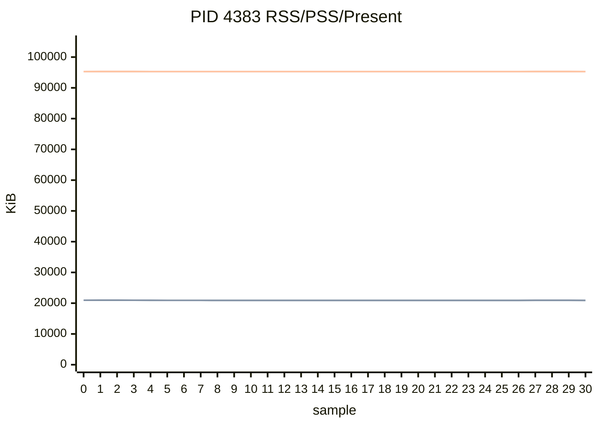
```mermaid
xychart-beta
    title "PID 4383 RSS/PSS/Present"
    x-axis "sample" ["0", "1", "2", "3", "4", "5", "6", "7", "8", "9", "10", "11", "12", "13", "14", "15", "16", "17", "18", "19", "20", "21", "22", "23", "24", "25", "26", "27", "28", "29", "30"]
    y-axis "KiB" 0 --> 104835
    line "RSS" [95288, 95304, 95304, 95304, 95288, 95288, 95288, 95288, 95288, 95288, 95288, 95288, 95288, 95288, 95288, 95288, 95288, 95288, 95288, 95288, 95288, 95288, 95288, 95288, 95288, 95288, 95288, 95304, 95304, 95304, 95288]
    line "PSS" [20956, 20968, 20966, 20961, 20945, 20926, 20926, 20926, 20915, 20915, 20915, 20915, 20915, 20915, 20915, 20915, 20915, 20915, 20915, 20915, 20915, 20915, 20915, 20915, 20915, 20915, 20915, 20931, 20931, 20931, 20915]
    line "Present" [95288, 95304, 95304, 95304, 95288, 95288, 95288, 95288, 95288, 95288, 95288, 95288, 95288, 95288, 95288, 95288, 95288, 95288, 95288, 95288, 95288, 95288, 95288, 95288, 95288, 95288, 95288, 95304, 95304, 95304, 95288]
```

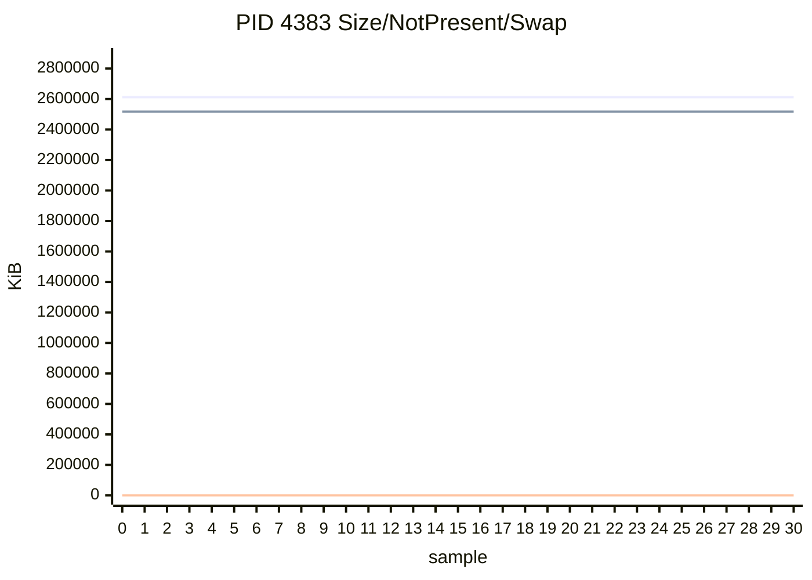
```mermaid
xychart-beta
    title "PID 4383 Size/NotPresent/Swap"
    x-axis "sample" ["0", "1", "2", "3", "4", "5", "6", "7", "8", "9", "10", "11", "12", "13", "14", "15", "16", "17", "18", "19", "20", "21", "22", "23", "24", "25", "26", "27", "28", "29", "30"]
    y-axis "KiB" 0 --> 2873487
    line "Size" [2612244, 2612260, 2612260, 2612260, 2612244, 2612244, 2612244, 2612244, 2612244, 2612244, 2612244, 2612244, 2612244, 2612244, 2612244, 2612244, 2612244, 2612244, 2612244, 2612244, 2612244, 2612244, 2612244, 2612244, 2612244, 2612244, 2612244, 2612260, 2612260, 2612260, 2612244]
    line "NotPresent" [2517016, 2517016, 2517016, 2517016, 2517016, 2517016, 2517016, 2517016, 2517016, 2517016, 2517016, 2517016, 2517016, 2517016, 2517016, 2517016, 2517016, 2517016, 2517016, 2517016, 2517016, 2517016, 2517016, 2517016, 2517016, 2517016, 2517016, 2517016, 2517016, 2517016, 2517016]
    line "Swap" [0, 0, 0, 0, 0, 0, 0, 0, 0, 0, 0, 0, 0, 0, 0, 0, 0, 0, 0, 0, 0, 0, 0, 0, 0, 0, 0, 0, 0, 0, 0]
```

| sample | Size | RSS | PSS | Present | NotPresent | Swap | 虚拟页 | Present页 | Swap页 |
| ---: | ---: | ---: | ---: | ---: | ---: | ---: | ---: | ---: | ---: |
| 0 | 2612244 | 95288 | 20956 | 95288 | 2517016 | 0 | 653076 | 23822 | 0 |
| 1 | 2612260 | 95304 | 20968 | 95304 | 2517016 | 0 | 653080 | 23826 | 0 |
| 2 | 2612260 | 95304 | 20966 | 95304 | 2517016 | 0 | 653080 | 23826 | 0 |
| 3 | 2612260 | 95304 | 20961 | 95304 | 2517016 | 0 | 653080 | 23826 | 0 |
| 4 | 2612244 | 95288 | 20945 | 95288 | 2517016 | 0 | 653076 | 23822 | 0 |
| 5 | 2612244 | 95288 | 20926 | 95288 | 2517016 | 0 | 653076 | 23822 | 0 |
| 6 | 2612244 | 95288 | 20926 | 95288 | 2517016 | 0 | 653076 | 23822 | 0 |
| 7 | 2612244 | 95288 | 20926 | 95288 | 2517016 | 0 | 653076 | 23822 | 0 |
| 8 | 2612244 | 95288 | 20915 | 95288 | 2517016 | 0 | 653076 | 23822 | 0 |
| 9 | 2612244 | 95288 | 20915 | 95288 | 2517016 | 0 | 653076 | 23822 | 0 |
| 10 | 2612244 | 95288 | 20915 | 95288 | 2517016 | 0 | 653076 | 23822 | 0 |
| 11 | 2612244 | 95288 | 20915 | 95288 | 2517016 | 0 | 653076 | 23822 | 0 |
| 12 | 2612244 | 95288 | 20915 | 95288 | 2517016 | 0 | 653076 | 23822 | 0 |
| 13 | 2612244 | 95288 | 20915 | 95288 | 2517016 | 0 | 653076 | 23822 | 0 |
| 14 | 2612244 | 95288 | 20915 | 95288 | 2517016 | 0 | 653076 | 23822 | 0 |
| 15 | 2612244 | 95288 | 20915 | 95288 | 2517016 | 0 | 653076 | 23822 | 0 |
| 16 | 2612244 | 95288 | 20915 | 95288 | 2517016 | 0 | 653076 | 23822 | 0 |
| 17 | 2612244 | 95288 | 20915 | 95288 | 2517016 | 0 | 653076 | 23822 | 0 |
| 18 | 2612244 | 95288 | 20915 | 95288 | 2517016 | 0 | 653076 | 23822 | 0 |
| 19 | 2612244 | 95288 | 20915 | 95288 | 2517016 | 0 | 653076 | 23822 | 0 |
| 20 | 2612244 | 95288 | 20915 | 95288 | 2517016 | 0 | 653076 | 23822 | 0 |
| 21 | 2612244 | 95288 | 20915 | 95288 | 2517016 | 0 | 653076 | 23822 | 0 |
| 22 | 2612244 | 95288 | 20915 | 95288 | 2517016 | 0 | 653076 | 23822 | 0 |
| 23 | 2612244 | 95288 | 20915 | 95288 | 2517016 | 0 | 653076 | 23822 | 0 |
| 24 | 2612244 | 95288 | 20915 | 95288 | 2517016 | 0 | 653076 | 23822 | 0 |
| 25 | 2612244 | 95288 | 20915 | 95288 | 2517016 | 0 | 653076 | 23822 | 0 |
| 26 | 2612244 | 95288 | 20915 | 95288 | 2517016 | 0 | 653076 | 23822 | 0 |
| 27 | 2612260 | 95304 | 20931 | 95304 | 2517016 | 0 | 653080 | 23826 | 0 |
| 28 | 2612260 | 95304 | 20931 | 95304 | 2517016 | 0 | 653080 | 23826 | 0 |
| 29 | 2612260 | 95304 | 20931 | 95304 | 2517016 | 0 | 653080 | 23826 | 0 |
| 30 | 2612244 | 95288 | 20915 | 95288 | 2517016 | 0 | 653076 | 23822 | 0 |

## PID 4641 `WebExtensions`

- 命令行：`/snap/firefox/7766/usr/lib/firefox/firefox -contentproc -isForBrowser -prefsHandle 0:36697 -prefMapHandle 1:276953 -jsInitHandle 2:223968 -parentBuildID 20260204004611 -sandboxReporter 3 -chrootClient 4 -ipcHandle 5 -initialChannelId {9cb485b7-89ac-4a31-928c-6a1066d945b2} -parentPid 3985 -crashReporter 6 -crashHelper 7 -greomni /snap/firefox/7766/usr/lib/firefox/omni.ja -appomni /snap/firefox/7766/usr/lib/firefox/browser/omni.ja -appDir /snap/firefox/7766/usr/lib/firefox/browser 8 tab`
- 采样次数：`31`

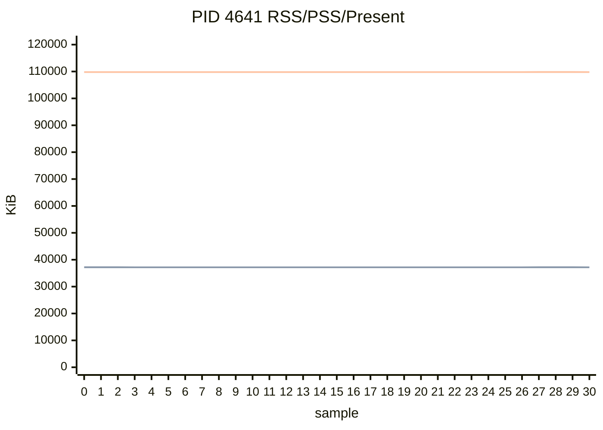
```mermaid
xychart-beta
    title "PID 4641 RSS/PSS/Present"
    x-axis "sample" ["0", "1", "2", "3", "4", "5", "6", "7", "8", "9", "10", "11", "12", "13", "14", "15", "16", "17", "18", "19", "20", "21", "22", "23", "24", "25", "26", "27", "28", "29", "30"]
    y-axis "KiB" 0 --> 120785
    line "RSS" [109788, 109788, 109788, 109788, 109788, 109788, 109788, 109788, 109788, 109788, 109788, 109788, 109788, 109788, 109788, 109788, 109788, 109788, 109788, 109788, 109788, 109788, 109788, 109788, 109788, 109788, 109788, 109804, 109804, 109804, 109788]
    line "PSS" [37206, 37188, 37186, 37181, 37181, 37181, 37181, 37181, 37181, 37181, 37181, 37181, 37181, 37181, 37181, 37181, 37181, 37181, 37181, 37181, 37181, 37181, 37181, 37181, 37181, 37181, 37181, 37197, 37197, 37197, 37181]
    line "Present" [109788, 109788, 109788, 109788, 109788, 109788, 109788, 109788, 109788, 109788, 109788, 109788, 109788, 109788, 109788, 109788, 109788, 109788, 109788, 109788, 109788, 109788, 109788, 109788, 109788, 109788, 109788, 109804, 109804, 109804, 109788]
```

```mermaid
xychart-beta
    title "PID 4641 Size/NotPresent/Swap"
    x-axis "sample" ["0", "1", "2", "3", "4", "5", "6", "7", "8", "9", "10", "11", "12", "13", "14", "15", "16", "17", "18", "19", "20", "21", "22", "23", "24", "25", "26", "27", "28", "29", "30"]
    y-axis "KiB" 0 --> 2885587
    line "Size" [2623244, 2623244, 2623244, 2623244, 2623244, 2623244, 2623244, 2623244, 2623244, 2623244, 2623244, 2623244, 2623244, 2623244, 2623244, 2623244, 2623244, 2623244, 2623244, 2623244, 2623244, 2623244, 2623244, 2623244, 2623244, 2623244, 2623244, 2623260, 2623260, 2623260, 2623244]
    line "NotPresent" [2513644, 2513644, 2513644, 2513644, 2513644, 2513644, 2513644, 2513644, 2513644, 2513644, 2513644, 2513644, 2513644, 2513644, 2513644, 2513644, 2513644, 2513644, 2513644, 2513644, 2513644, 2513644, 2513644, 2513644, 2513644, 2513644, 2513644, 2513644, 2513644, 2513644, 2513644]
    line "Swap" [0, 0, 0, 0, 0, 0, 0, 0, 0, 0, 0, 0, 0, 0, 0, 0, 0, 0, 0, 0, 0, 0, 0, 0, 0, 0, 0, 0, 0, 0, 0]
```

| sample | Size | RSS | PSS | Present | NotPresent | Swap | 虚拟页 | Present页 | Swap页 |
| ---: | ---: | ---: | ---: | ---: | ---: | ---: | ---: | ---: | ---: |
| 0 | 2623244 | 109788 | 37206 | 109788 | 2513644 | 0 | 655858 | 27447 | 0 |
| 1 | 2623244 | 109788 | 37188 | 109788 | 2513644 | 0 | 655858 | 27447 | 0 |
| 2 | 2623244 | 109788 | 37186 | 109788 | 2513644 | 0 | 655858 | 27447 | 0 |
| 3 | 2623244 | 109788 | 37181 | 109788 | 2513644 | 0 | 655858 | 27447 | 0 |
| 4 | 2623244 | 109788 | 37181 | 109788 | 2513644 | 0 | 655858 | 27447 | 0 |
| 5 | 2623244 | 109788 | 37181 | 109788 | 2513644 | 0 | 655858 | 27447 | 0 |
| 6 | 2623244 | 109788 | 37181 | 109788 | 2513644 | 0 | 655858 | 27447 | 0 |
| 7 | 2623244 | 109788 | 37181 | 109788 | 2513644 | 0 | 655858 | 27447 | 0 |
| 8 | 2623244 | 109788 | 37181 | 109788 | 2513644 | 0 | 655858 | 27447 | 0 |
| 9 | 2623244 | 109788 | 37181 | 109788 | 2513644 | 0 | 655858 | 27447 | 0 |
| 10 | 2623244 | 109788 | 37181 | 109788 | 2513644 | 0 | 655858 | 27447 | 0 |
| 11 | 2623244 | 109788 | 37181 | 109788 | 2513644 | 0 | 655858 | 27447 | 0 |
| 12 | 2623244 | 109788 | 37181 | 109788 | 2513644 | 0 | 655858 | 27447 | 0 |
| 13 | 2623244 | 109788 | 37181 | 109788 | 2513644 | 0 | 655858 | 27447 | 0 |
| 14 | 2623244 | 109788 | 37181 | 109788 | 2513644 | 0 | 655858 | 27447 | 0 |
| 15 | 2623244 | 109788 | 37181 | 109788 | 2513644 | 0 | 655858 | 27447 | 0 |
| 16 | 2623244 | 109788 | 37181 | 109788 | 2513644 | 0 | 655858 | 27447 | 0 |
| 17 | 2623244 | 109788 | 37181 | 109788 | 2513644 | 0 | 655858 | 27447 | 0 |
| 18 | 2623244 | 109788 | 37181 | 109788 | 2513644 | 0 | 655858 | 27447 | 0 |
| 19 | 2623244 | 109788 | 37181 | 109788 | 2513644 | 0 | 655858 | 27447 | 0 |
| 20 | 2623244 | 109788 | 37181 | 109788 | 2513644 | 0 | 655858 | 27447 | 0 |
| 21 | 2623244 | 109788 | 37181 | 109788 | 2513644 | 0 | 655858 | 27447 | 0 |
| 22 | 2623244 | 109788 | 37181 | 109788 | 2513644 | 0 | 655858 | 27447 | 0 |
| 23 | 2623244 | 109788 | 37181 | 109788 | 2513644 | 0 | 655858 | 27447 | 0 |
| 24 | 2623244 | 109788 | 37181 | 109788 | 2513644 | 0 | 655858 | 27447 | 0 |
| 25 | 2623244 | 109788 | 37181 | 109788 | 2513644 | 0 | 655858 | 27447 | 0 |
| 26 | 2623244 | 109788 | 37181 | 109788 | 2513644 | 0 | 655858 | 27447 | 0 |
| 27 | 2623260 | 109804 | 37197 | 109804 | 2513644 | 0 | 655862 | 27451 | 0 |
| 28 | 2623260 | 109804 | 37197 | 109804 | 2513644 | 0 | 655862 | 27451 | 0 |
| 29 | 2623260 | 109804 | 37197 | 109804 | 2513644 | 0 | 655862 | 27451 | 0 |
| 30 | 2623244 | 109788 | 37181 | 109788 | 2513644 | 0 | 655858 | 27447 | 0 |

## PID 4979 `Utility Process`

- 命令行：`/snap/firefox/7766/usr/lib/firefox/firefox -contentproc -parentBuildID 20260204004611 -sandboxingKind 0 -prefsHandle 0:46529 -prefMapHandle 1:276953 -sandboxReporter 2 -chrootClient 3 -ipcHandle 4 -initialChannelId {3724f600-e718-4d0a-aebd-18bc14c214d2} -parentPid 3985 -crashReporter 5 -crashHelper 6 -appDir /snap/firefox/7766/usr/lib/firefox/browser 9 utility`
- 采样次数：`31`

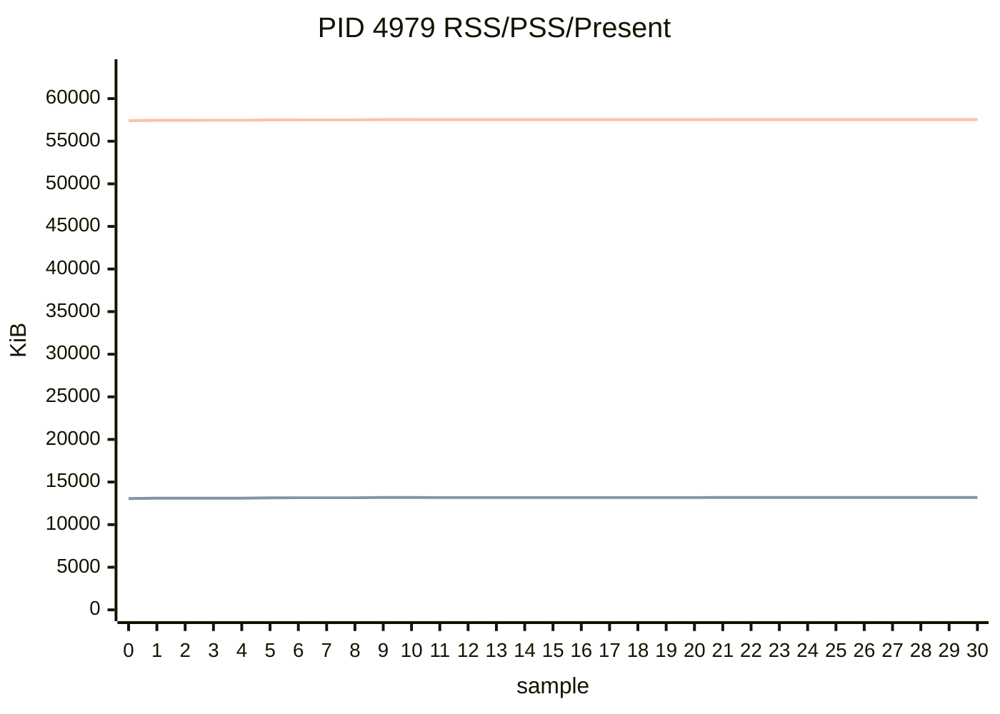
```mermaid
xychart-beta
    title "PID 4979 RSS/PSS/Present"
    x-axis "sample" ["0", "1", "2", "3", "4", "5", "6", "7", "8", "9", "10", "11", "12", "13", "14", "15", "16", "17", "18", "19", "20", "21", "22", "23", "24", "25", "26", "27", "28", "29", "30"]
    y-axis "KiB" 0 --> 63290
    line "RSS" [57408, 57452, 57456, 57460, 57460, 57492, 57504, 57504, 57504, 57532, 57532, 57528, 57528, 57528, 57528, 57528, 57528, 57528, 57528, 57528, 57528, 57532, 57532, 57532, 57532, 57532, 57532, 57532, 57532, 57532, 57532]
    line "PSS" [13064, 13102, 13106, 13110, 13110, 13142, 13154, 13154, 13154, 13182, 13182, 13178, 13178, 13178, 13178, 13178, 13178, 13178, 13178, 13178, 13178, 13182, 13182, 13182, 13182, 13182, 13182, 13182, 13182, 13182, 13182]
    line "Present" [57412, 57456, 57460, 57464, 57464, 57496, 57508, 57508, 57508, 57536, 57536, 57532, 57532, 57532, 57532, 57532, 57532, 57532, 57532, 57532, 57532, 57536, 57536, 57536, 57536, 57536, 57536, 57536, 57536, 57536, 57536]
```

```mermaid
xychart-beta
    title "PID 4979 Size/NotPresent/Swap"
    x-axis "sample" ["0", "1", "2", "3", "4", "5", "6", "7", "8", "9", "10", "11", "12", "13", "14", "15", "16", "17", "18", "19", "20", "21", "22", "23", "24", "25", "26", "27", "28", "29", "30"]
    y-axis "KiB" 0 --> 646110
    line "Size" [586488, 586564, 586564, 586564, 586564, 586840, 586840, 586840, 586840, 587372, 587372, 587356, 587356, 587356, 587356, 587356, 587356, 587340, 587340, 587340, 587340, 587340, 587356, 587356, 587356, 587356, 587356, 587356, 587340, 587340, 587340]
    line "NotPresent" [529072, 529104, 529100, 529096, 529096, 529340, 529328, 529328, 529328, 529832, 529832, 529820, 529820, 529820, 529820, 529820, 529820, 529804, 529804, 529804, 529804, 529800, 529816, 529816, 529816, 529816, 529816, 529816, 529800, 529800, 529800]
    line "Swap" [0, 0, 0, 0, 0, 0, 0, 0, 0, 0, 0, 0, 0, 0, 0, 0, 0, 0, 0, 0, 0, 0, 0, 0, 0, 0, 0, 0, 0, 0, 0]
```

| sample | Size | RSS | PSS | Present | NotPresent | Swap | 虚拟页 | Present页 | Swap页 |
| ---: | ---: | ---: | ---: | ---: | ---: | ---: | ---: | ---: | ---: |
| 0 | 586488 | 57408 | 13064 | 57412 | 529072 | 0 | 146621 | 14353 | 0 |
| 1 | 586564 | 57452 | 13102 | 57456 | 529104 | 0 | 146640 | 14364 | 0 |
| 2 | 586564 | 57456 | 13106 | 57460 | 529100 | 0 | 146640 | 14365 | 0 |
| 3 | 586564 | 57460 | 13110 | 57464 | 529096 | 0 | 146640 | 14366 | 0 |
| 4 | 586564 | 57460 | 13110 | 57464 | 529096 | 0 | 146640 | 14366 | 0 |
| 5 | 586840 | 57492 | 13142 | 57496 | 529340 | 0 | 146709 | 14374 | 0 |
| 6 | 586840 | 57504 | 13154 | 57508 | 529328 | 0 | 146709 | 14377 | 0 |
| 7 | 586840 | 57504 | 13154 | 57508 | 529328 | 0 | 146709 | 14377 | 0 |
| 8 | 586840 | 57504 | 13154 | 57508 | 529328 | 0 | 146709 | 14377 | 0 |
| 9 | 587372 | 57532 | 13182 | 57536 | 529832 | 0 | 146842 | 14384 | 0 |
| 10 | 587372 | 57532 | 13182 | 57536 | 529832 | 0 | 146842 | 14384 | 0 |
| 11 | 587356 | 57528 | 13178 | 57532 | 529820 | 0 | 146838 | 14383 | 0 |
| 12 | 587356 | 57528 | 13178 | 57532 | 529820 | 0 | 146838 | 14383 | 0 |
| 13 | 587356 | 57528 | 13178 | 57532 | 529820 | 0 | 146838 | 14383 | 0 |
| 14 | 587356 | 57528 | 13178 | 57532 | 529820 | 0 | 146838 | 14383 | 0 |
| 15 | 587356 | 57528 | 13178 | 57532 | 529820 | 0 | 146838 | 14383 | 0 |
| 16 | 587356 | 57528 | 13178 | 57532 | 529820 | 0 | 146838 | 14383 | 0 |
| 17 | 587340 | 57528 | 13178 | 57532 | 529804 | 0 | 146834 | 14383 | 0 |
| 18 | 587340 | 57528 | 13178 | 57532 | 529804 | 0 | 146834 | 14383 | 0 |
| 19 | 587340 | 57528 | 13178 | 57532 | 529804 | 0 | 146834 | 14383 | 0 |
| 20 | 587340 | 57528 | 13178 | 57532 | 529804 | 0 | 146834 | 14383 | 0 |
| 21 | 587340 | 57532 | 13182 | 57536 | 529800 | 0 | 146834 | 14384 | 0 |
| 22 | 587356 | 57532 | 13182 | 57536 | 529816 | 0 | 146838 | 14384 | 0 |
| 23 | 587356 | 57532 | 13182 | 57536 | 529816 | 0 | 146838 | 14384 | 0 |
| 24 | 587356 | 57532 | 13182 | 57536 | 529816 | 0 | 146838 | 14384 | 0 |
| 25 | 587356 | 57532 | 13182 | 57536 | 529816 | 0 | 146838 | 14384 | 0 |
| 26 | 587356 | 57532 | 13182 | 57536 | 529816 | 0 | 146838 | 14384 | 0 |
| 27 | 587356 | 57532 | 13182 | 57536 | 529816 | 0 | 146838 | 14384 | 0 |
| 28 | 587340 | 57532 | 13182 | 57536 | 529800 | 0 | 146834 | 14384 | 0 |
| 29 | 587340 | 57532 | 13182 | 57536 | 529800 | 0 | 146834 | 14384 | 0 |
| 30 | 587340 | 57532 | 13182 | 57536 | 529800 | 0 | 146834 | 14384 | 0 |

## PID 7826 `Web Content`

- 命令行：`/snap/firefox/7766/usr/lib/firefox/firefox -contentproc -isForBrowser -prefsHandle 0:41964 -prefMapHandle 1:276953 -jsInitHandle 2:223968 -parentBuildID 20260204004611 -sandboxReporter 3 -chrootClient 4 -ipcHandle 5 -initialChannelId {8695cfef-f9cf-4965-8638-f1ee9f6aead2} -parentPid 3985 -crashReporter 6 -crashHelper 7 -greomni /snap/firefox/7766/usr/lib/firefox/omni.ja -appomni /snap/firefox/7766/usr/lib/firefox/browser/omni.ja -appDir /snap/firefox/7766/usr/lib/firefox/browser 10 tab`
- 采样次数：`31`

```mermaid
xychart-beta
    title "PID 7826 RSS/PSS/Present"
    x-axis "sample" ["0", "1", "2", "3", "4", "5", "6", "7", "8", "9", "10", "11", "12", "13", "14", "15", "16", "17", "18", "19", "20", "21", "22", "23", "24", "25", "26", "27", "28", "29", "30"]
    y-axis "KiB" 0 --> 79953
    line "RSS" [72684, 72684, 72684, 72684, 72684, 72684, 72684, 72684, 72684, 72684, 72684, 72684, 72684, 72684, 72684, 72684, 72684, 72684, 72684, 72684, 72684, 72684, 72684, 72684, 72684, 72684, 72684, 72684, 72684, 72684, 72684]
    line "PSS" [13298, 13298, 13298, 13297, 13297, 13297, 13297, 13297, 13297, 13297, 13297, 13297, 13297, 13297, 13297, 13297, 13297, 13297, 13297, 13297, 13297, 13297, 13297, 13297, 13297, 13297, 13297, 13297, 13297, 13297, 13297]
    line "Present" [72684, 72684, 72684, 72684, 72684, 72684, 72684, 72684, 72684, 72684, 72684, 72684, 72684, 72684, 72684, 72684, 72684, 72684, 72684, 72684, 72684, 72684, 72684, 72684, 72684, 72684, 72684, 72684, 72684, 72684, 72684]
```

```mermaid
xychart-beta
    title "PID 7826 Size/NotPresent/Swap"
    x-axis "sample" ["0", "1", "2", "3", "4", "5", "6", "7", "8", "9", "10", "11", "12", "13", "14", "15", "16", "17", "18", "19", "20", "21", "22", "23", "24", "25", "26", "27", "28", "29", "30"]
    y-axis "KiB" 0 --> 2817237
    line "Size" [2561124, 2561124, 2561124, 2561124, 2561124, 2561124, 2561124, 2561124, 2561124, 2561124, 2561124, 2561124, 2561124, 2561124, 2561124, 2561124, 2561124, 2561124, 2561124, 2561124, 2561124, 2561124, 2561124, 2561124, 2561124, 2561124, 2561124, 2561124, 2561124, 2561124, 2561124]
    line "NotPresent" [2488500, 2488500, 2488500, 2488500, 2488500, 2488500, 2488500, 2488500, 2488500, 2488500, 2488500, 2488500, 2488500, 2488500, 2488500, 2488500, 2488500, 2488500, 2488500, 2488500, 2488500, 2488500, 2488500, 2488500, 2488500, 2488500, 2488500, 2488500, 2488500, 2488500, 2488500]
    line "Swap" [0, 0, 0, 0, 0, 0, 0, 0, 0, 0, 0, 0, 0, 0, 0, 0, 0, 0, 0, 0, 0, 0, 0, 0, 0, 0, 0, 0, 0, 0, 0]
```

| sample | Size | RSS | PSS | Present | NotPresent | Swap | 虚拟页 | Present页 | Swap页 |
| ---: | ---: | ---: | ---: | ---: | ---: | ---: | ---: | ---: | ---: |
| 0 | 2561124 | 72684 | 13298 | 72684 | 2488500 | 0 | 640296 | 18171 | 0 |
| 1 | 2561124 | 72684 | 13298 | 72684 | 2488500 | 0 | 640296 | 18171 | 0 |
| 2 | 2561124 | 72684 | 13298 | 72684 | 2488500 | 0 | 640296 | 18171 | 0 |
| 3 | 2561124 | 72684 | 13297 | 72684 | 2488500 | 0 | 640296 | 18171 | 0 |
| 4 | 2561124 | 72684 | 13297 | 72684 | 2488500 | 0 | 640296 | 18171 | 0 |
| 5 | 2561124 | 72684 | 13297 | 72684 | 2488500 | 0 | 640296 | 18171 | 0 |
| 6 | 2561124 | 72684 | 13297 | 72684 | 2488500 | 0 | 640296 | 18171 | 0 |
| 7 | 2561124 | 72684 | 13297 | 72684 | 2488500 | 0 | 640296 | 18171 | 0 |
| 8 | 2561124 | 72684 | 13297 | 72684 | 2488500 | 0 | 640296 | 18171 | 0 |
| 9 | 2561124 | 72684 | 13297 | 72684 | 2488500 | 0 | 640296 | 18171 | 0 |
| 10 | 2561124 | 72684 | 13297 | 72684 | 2488500 | 0 | 640296 | 18171 | 0 |
| 11 | 2561124 | 72684 | 13297 | 72684 | 2488500 | 0 | 640296 | 18171 | 0 |
| 12 | 2561124 | 72684 | 13297 | 72684 | 2488500 | 0 | 640296 | 18171 | 0 |
| 13 | 2561124 | 72684 | 13297 | 72684 | 2488500 | 0 | 640296 | 18171 | 0 |
| 14 | 2561124 | 72684 | 13297 | 72684 | 2488500 | 0 | 640296 | 18171 | 0 |
| 15 | 2561124 | 72684 | 13297 | 72684 | 2488500 | 0 | 640296 | 18171 | 0 |
| 16 | 2561124 | 72684 | 13297 | 72684 | 2488500 | 0 | 640296 | 18171 | 0 |
| 17 | 2561124 | 72684 | 13297 | 72684 | 2488500 | 0 | 640296 | 18171 | 0 |
| 18 | 2561124 | 72684 | 13297 | 72684 | 2488500 | 0 | 640296 | 18171 | 0 |
| 19 | 2561124 | 72684 | 13297 | 72684 | 2488500 | 0 | 640296 | 18171 | 0 |
| 20 | 2561124 | 72684 | 13297 | 72684 | 2488500 | 0 | 640296 | 18171 | 0 |
| 21 | 2561124 | 72684 | 13297 | 72684 | 2488500 | 0 | 640296 | 18171 | 0 |
| 22 | 2561124 | 72684 | 13297 | 72684 | 2488500 | 0 | 640296 | 18171 | 0 |
| 23 | 2561124 | 72684 | 13297 | 72684 | 2488500 | 0 | 640296 | 18171 | 0 |
| 24 | 2561124 | 72684 | 13297 | 72684 | 2488500 | 0 | 640296 | 18171 | 0 |
| 25 | 2561124 | 72684 | 13297 | 72684 | 2488500 | 0 | 640296 | 18171 | 0 |
| 26 | 2561124 | 72684 | 13297 | 72684 | 2488500 | 0 | 640296 | 18171 | 0 |
| 27 | 2561124 | 72684 | 13297 | 72684 | 2488500 | 0 | 640296 | 18171 | 0 |
| 28 | 2561124 | 72684 | 13297 | 72684 | 2488500 | 0 | 640296 | 18171 | 0 |
| 29 | 2561124 | 72684 | 13297 | 72684 | 2488500 | 0 | 640296 | 18171 | 0 |
| 30 | 2561124 | 72684 | 13297 | 72684 | 2488500 | 0 | 640296 | 18171 | 0 |

## PID 7864 `Web Content`

- 命令行：`/snap/firefox/7766/usr/lib/firefox/firefox -contentproc -isForBrowser -prefsHandle 0:41964 -prefMapHandle 1:276953 -jsInitHandle 2:223968 -parentBuildID 20260204004611 -sandboxReporter 3 -chrootClient 4 -ipcHandle 5 -initialChannelId {b5c96164-60d3-4f3d-b2a6-a1c4c22a6718} -parentPid 3985 -crashReporter 6 -crashHelper 7 -greomni /snap/firefox/7766/usr/lib/firefox/omni.ja -appomni /snap/firefox/7766/usr/lib/firefox/browser/omni.ja -appDir /snap/firefox/7766/usr/lib/firefox/browser 12 tab`
- 采样次数：`31`

```mermaid
xychart-beta
    title "PID 7864 RSS/PSS/Present"
    x-axis "sample" ["0", "1", "2", "3", "4", "5", "6", "7", "8", "9", "10", "11", "12", "13", "14", "15", "16", "17", "18", "19", "20", "21", "22", "23", "24", "25", "26", "27", "28", "29", "30"]
    y-axis "KiB" 0 --> 80934
    line "RSS" [73576, 73576, 73576, 73576, 73576, 73576, 73576, 73576, 73576, 73576, 73576, 73576, 73576, 73576, 73576, 73576, 73576, 73576, 73576, 73576, 73576, 73576, 73576, 73576, 73576, 73576, 73576, 73576, 73576, 73576, 73576]
    line "PSS" [13465, 13465, 13465, 13465, 13465, 13465, 13465, 13465, 13465, 13465, 13465, 13465, 13465, 13465, 13465, 13465, 13465, 13465, 13465, 13465, 13465, 13465, 13465, 13465, 13465, 13465, 13465, 13465, 13465, 13465, 13465]
    line "Present" [73576, 73576, 73576, 73576, 73576, 73576, 73576, 73576, 73576, 73576, 73576, 73576, 73576, 73576, 73576, 73576, 73576, 73576, 73576, 73576, 73576, 73576, 73576, 73576, 73576, 73576, 73576, 73576, 73576, 73576, 73576]
```

```mermaid
xychart-beta
    title "PID 7864 Size/NotPresent/Swap"
    x-axis "sample" ["0", "1", "2", "3", "4", "5", "6", "7", "8", "9", "10", "11", "12", "13", "14", "15", "16", "17", "18", "19", "20", "21", "22", "23", "24", "25", "26", "27", "28", "29", "30"]
    y-axis "KiB" 0 --> 2817237
    line "Size" [2561124, 2561124, 2561124, 2561124, 2561124, 2561124, 2561124, 2561124, 2561124, 2561124, 2561124, 2561124, 2561124, 2561124, 2561124, 2561124, 2561124, 2561124, 2561124, 2561124, 2561124, 2561124, 2561124, 2561124, 2561124, 2561124, 2561124, 2561124, 2561124, 2561124, 2561124]
    line "NotPresent" [2487608, 2487608, 2487608, 2487608, 2487608, 2487608, 2487608, 2487608, 2487608, 2487608, 2487608, 2487608, 2487608, 2487608, 2487608, 2487608, 2487608, 2487608, 2487608, 2487608, 2487608, 2487608, 2487608, 2487608, 2487608, 2487608, 2487608, 2487608, 2487608, 2487608, 2487608]
    line "Swap" [0, 0, 0, 0, 0, 0, 0, 0, 0, 0, 0, 0, 0, 0, 0, 0, 0, 0, 0, 0, 0, 0, 0, 0, 0, 0, 0, 0, 0, 0, 0]
```

| sample | Size | RSS | PSS | Present | NotPresent | Swap | 虚拟页 | Present页 | Swap页 |
| ---: | ---: | ---: | ---: | ---: | ---: | ---: | ---: | ---: | ---: |
| 0 | 2561124 | 73576 | 13465 | 73576 | 2487608 | 0 | 640296 | 18394 | 0 |
| 1 | 2561124 | 73576 | 13465 | 73576 | 2487608 | 0 | 640296 | 18394 | 0 |
| 2 | 2561124 | 73576 | 13465 | 73576 | 2487608 | 0 | 640296 | 18394 | 0 |
| 3 | 2561124 | 73576 | 13465 | 73576 | 2487608 | 0 | 640296 | 18394 | 0 |
| 4 | 2561124 | 73576 | 13465 | 73576 | 2487608 | 0 | 640296 | 18394 | 0 |
| 5 | 2561124 | 73576 | 13465 | 73576 | 2487608 | 0 | 640296 | 18394 | 0 |
| 6 | 2561124 | 73576 | 13465 | 73576 | 2487608 | 0 | 640296 | 18394 | 0 |
| 7 | 2561124 | 73576 | 13465 | 73576 | 2487608 | 0 | 640296 | 18394 | 0 |
| 8 | 2561124 | 73576 | 13465 | 73576 | 2487608 | 0 | 640296 | 18394 | 0 |
| 9 | 2561124 | 73576 | 13465 | 73576 | 2487608 | 0 | 640296 | 18394 | 0 |
| 10 | 2561124 | 73576 | 13465 | 73576 | 2487608 | 0 | 640296 | 18394 | 0 |
| 11 | 2561124 | 73576 | 13465 | 73576 | 2487608 | 0 | 640296 | 18394 | 0 |
| 12 | 2561124 | 73576 | 13465 | 73576 | 2487608 | 0 | 640296 | 18394 | 0 |
| 13 | 2561124 | 73576 | 13465 | 73576 | 2487608 | 0 | 640296 | 18394 | 0 |
| 14 | 2561124 | 73576 | 13465 | 73576 | 2487608 | 0 | 640296 | 18394 | 0 |
| 15 | 2561124 | 73576 | 13465 | 73576 | 2487608 | 0 | 640296 | 18394 | 0 |
| 16 | 2561124 | 73576 | 13465 | 73576 | 2487608 | 0 | 640296 | 18394 | 0 |
| 17 | 2561124 | 73576 | 13465 | 73576 | 2487608 | 0 | 640296 | 18394 | 0 |
| 18 | 2561124 | 73576 | 13465 | 73576 | 2487608 | 0 | 640296 | 18394 | 0 |
| 19 | 2561124 | 73576 | 13465 | 73576 | 2487608 | 0 | 640296 | 18394 | 0 |
| 20 | 2561124 | 73576 | 13465 | 73576 | 2487608 | 0 | 640296 | 18394 | 0 |
| 21 | 2561124 | 73576 | 13465 | 73576 | 2487608 | 0 | 640296 | 18394 | 0 |
| 22 | 2561124 | 73576 | 13465 | 73576 | 2487608 | 0 | 640296 | 18394 | 0 |
| 23 | 2561124 | 73576 | 13465 | 73576 | 2487608 | 0 | 640296 | 18394 | 0 |
| 24 | 2561124 | 73576 | 13465 | 73576 | 2487608 | 0 | 640296 | 18394 | 0 |
| 25 | 2561124 | 73576 | 13465 | 73576 | 2487608 | 0 | 640296 | 18394 | 0 |
| 26 | 2561124 | 73576 | 13465 | 73576 | 2487608 | 0 | 640296 | 18394 | 0 |
| 27 | 2561124 | 73576 | 13465 | 73576 | 2487608 | 0 | 640296 | 18394 | 0 |
| 28 | 2561124 | 73576 | 13465 | 73576 | 2487608 | 0 | 640296 | 18394 | 0 |
| 29 | 2561124 | 73576 | 13465 | 73576 | 2487608 | 0 | 640296 | 18394 | 0 |
| 30 | 2561124 | 73576 | 13465 | 73576 | 2487608 | 0 | 640296 | 18394 | 0 |

## PID 7936 `Web Content`

- 命令行：`/snap/firefox/7766/usr/lib/firefox/firefox -contentproc -isForBrowser -prefsHandle 0:41956 -prefMapHandle 1:276953 -jsInitHandle 2:223968 -parentBuildID 20260204004611 -sandboxReporter 3 -chrootClient 4 -ipcHandle 5 -initialChannelId {c2cb2bf1-86e0-4ae3-9858-86bf6da6e558} -parentPid 3985 -crashReporter 6 -crashHelper 7 -greomni /snap/firefox/7766/usr/lib/firefox/omni.ja -appomni /snap/firefox/7766/usr/lib/firefox/browser/omni.ja -appDir /snap/firefox/7766/usr/lib/firefox/browser 13 tab`
- 采样次数：`31`

```mermaid
xychart-beta
    title "PID 7936 RSS/PSS/Present"
    x-axis "sample" ["0", "1", "2", "3", "4", "5", "6", "7", "8", "9", "10", "11", "12", "13", "14", "15", "16", "17", "18", "19", "20", "21", "22", "23", "24", "25", "26", "27", "28", "29", "30"]
    y-axis "KiB" 0 --> 80661
    line "RSS" [73328, 73328, 73328, 73328, 73328, 73328, 73328, 73328, 73328, 73328, 73328, 73328, 73328, 73328, 73328, 73328, 73328, 73328, 73328, 73328, 73328, 73328, 73328, 73328, 73328, 73328, 73328, 73328, 73328, 73328, 73328]
    line "PSS" [13393, 13393, 13393, 13392, 13392, 13392, 13392, 13392, 13392, 13392, 13392, 13392, 13392, 13392, 13392, 13392, 13387, 13387, 13387, 13387, 13387, 13387, 13387, 13387, 13387, 13387, 13387, 13387, 13387, 13387, 13387]
    line "Present" [73328, 73328, 73328, 73328, 73328, 73328, 73328, 73328, 73328, 73328, 73328, 73328, 73328, 73328, 73328, 73328, 73328, 73328, 73328, 73328, 73328, 73328, 73328, 73328, 73328, 73328, 73328, 73328, 73328, 73328, 73328]
```

```mermaid
xychart-beta
    title "PID 7936 Size/NotPresent/Swap"
    x-axis "sample" ["0", "1", "2", "3", "4", "5", "6", "7", "8", "9", "10", "11", "12", "13", "14", "15", "16", "17", "18", "19", "20", "21", "22", "23", "24", "25", "26", "27", "28", "29", "30"]
    y-axis "KiB" 0 --> 2817237
    line "Size" [2561124, 2561124, 2561124, 2561124, 2561124, 2561124, 2561124, 2561124, 2561124, 2561124, 2561124, 2561124, 2561124, 2561124, 2561124, 2561124, 2561124, 2561124, 2561124, 2561124, 2561124, 2561124, 2561124, 2561124, 2561124, 2561124, 2561124, 2561124, 2561124, 2561124, 2561124]
    line "NotPresent" [2487856, 2487856, 2487856, 2487856, 2487856, 2487856, 2487856, 2487856, 2487856, 2487856, 2487856, 2487856, 2487856, 2487856, 2487856, 2487856, 2487856, 2487856, 2487856, 2487856, 2487856, 2487856, 2487856, 2487856, 2487856, 2487856, 2487856, 2487856, 2487856, 2487856, 2487856]
    line "Swap" [0, 0, 0, 0, 0, 0, 0, 0, 0, 0, 0, 0, 0, 0, 0, 0, 0, 0, 0, 0, 0, 0, 0, 0, 0, 0, 0, 0, 0, 0, 0]
```

| sample | Size | RSS | PSS | Present | NotPresent | Swap | 虚拟页 | Present页 | Swap页 |
| ---: | ---: | ---: | ---: | ---: | ---: | ---: | ---: | ---: | ---: |
| 0 | 2561124 | 73328 | 13393 | 73328 | 2487856 | 0 | 640296 | 18332 | 0 |
| 1 | 2561124 | 73328 | 13393 | 73328 | 2487856 | 0 | 640296 | 18332 | 0 |
| 2 | 2561124 | 73328 | 13393 | 73328 | 2487856 | 0 | 640296 | 18332 | 0 |
| 3 | 2561124 | 73328 | 13392 | 73328 | 2487856 | 0 | 640296 | 18332 | 0 |
| 4 | 2561124 | 73328 | 13392 | 73328 | 2487856 | 0 | 640296 | 18332 | 0 |
| 5 | 2561124 | 73328 | 13392 | 73328 | 2487856 | 0 | 640296 | 18332 | 0 |
| 6 | 2561124 | 73328 | 13392 | 73328 | 2487856 | 0 | 640296 | 18332 | 0 |
| 7 | 2561124 | 73328 | 13392 | 73328 | 2487856 | 0 | 640296 | 18332 | 0 |
| 8 | 2561124 | 73328 | 13392 | 73328 | 2487856 | 0 | 640296 | 18332 | 0 |
| 9 | 2561124 | 73328 | 13392 | 73328 | 2487856 | 0 | 640296 | 18332 | 0 |
| 10 | 2561124 | 73328 | 13392 | 73328 | 2487856 | 0 | 640296 | 18332 | 0 |
| 11 | 2561124 | 73328 | 13392 | 73328 | 2487856 | 0 | 640296 | 18332 | 0 |
| 12 | 2561124 | 73328 | 13392 | 73328 | 2487856 | 0 | 640296 | 18332 | 0 |
| 13 | 2561124 | 73328 | 13392 | 73328 | 2487856 | 0 | 640296 | 18332 | 0 |
| 14 | 2561124 | 73328 | 13392 | 73328 | 2487856 | 0 | 640296 | 18332 | 0 |
| 15 | 2561124 | 73328 | 13392 | 73328 | 2487856 | 0 | 640296 | 18332 | 0 |
| 16 | 2561124 | 73328 | 13387 | 73328 | 2487856 | 0 | 640296 | 18332 | 0 |
| 17 | 2561124 | 73328 | 13387 | 73328 | 2487856 | 0 | 640296 | 18332 | 0 |
| 18 | 2561124 | 73328 | 13387 | 73328 | 2487856 | 0 | 640296 | 18332 | 0 |
| 19 | 2561124 | 73328 | 13387 | 73328 | 2487856 | 0 | 640296 | 18332 | 0 |
| 20 | 2561124 | 73328 | 13387 | 73328 | 2487856 | 0 | 640296 | 18332 | 0 |
| 21 | 2561124 | 73328 | 13387 | 73328 | 2487856 | 0 | 640296 | 18332 | 0 |
| 22 | 2561124 | 73328 | 13387 | 73328 | 2487856 | 0 | 640296 | 18332 | 0 |
| 23 | 2561124 | 73328 | 13387 | 73328 | 2487856 | 0 | 640296 | 18332 | 0 |
| 24 | 2561124 | 73328 | 13387 | 73328 | 2487856 | 0 | 640296 | 18332 | 0 |
| 25 | 2561124 | 73328 | 13387 | 73328 | 2487856 | 0 | 640296 | 18332 | 0 |
| 26 | 2561124 | 73328 | 13387 | 73328 | 2487856 | 0 | 640296 | 18332 | 0 |
| 27 | 2561124 | 73328 | 13387 | 73328 | 2487856 | 0 | 640296 | 18332 | 0 |
| 28 | 2561124 | 73328 | 13387 | 73328 | 2487856 | 0 | 640296 | 18332 | 0 |
| 29 | 2561124 | 73328 | 13387 | 73328 | 2487856 | 0 | 640296 | 18332 | 0 |
| 30 | 2561124 | 73328 | 13387 | 73328 | 2487856 | 0 | 640296 | 18332 | 0 |

## PID 11012 `mem_analyze-v2`

- 命令行：`./mem_analyze-v2 --watch-app firefox --duration 60 --interval 2 -o firefox_watch.md`
- 采样次数：`31`

```mermaid
xychart-beta
    title "PID 11012 RSS/PSS/Present"
    x-axis "sample" ["0", "1", "2", "3", "4", "5", "6", "7", "8", "9", "10", "11", "12", "13", "14", "15", "16", "17", "18", "19", "20", "21", "22", "23", "24", "25", "26", "27", "28", "29", "30"]
    y-axis "KiB" 0 --> 27571
    line "RSS" [24688, 24836, 24840, 24840, 24840, 24844, 24848, 24848, 24848, 24848, 24852, 24852, 24852, 24852, 24852, 24852, 24972, 25064, 25064, 25064, 25064, 25064, 25064, 25064, 25064, 25064, 25064, 25064, 25064, 25064, 25064]
    line "PSS" [23074, 23159, 23163, 23163, 23163, 23167, 23171, 23171, 23171, 23171, 23175, 23175, 23176, 23176, 23176, 23176, 23296, 23388, 23388, 23388, 23388, 23388, 23388, 23388, 23388, 23388, 23388, 23388, 23388, 23388, 23388]
    line "Present" [24688, 24836, 24840, 24840, 24840, 24844, 24848, 24848, 24848, 24848, 24852, 24852, 24852, 24852, 24852, 24852, 24972, 25064, 25064, 25064, 25064, 25064, 25064, 25064, 25064, 25064, 25064, 25064, 25064, 25064, 25064]
```

```mermaid
xychart-beta
    title "PID 11012 Size/NotPresent/Swap"
    x-axis "sample" ["0", "1", "2", "3", "4", "5", "6", "7", "8", "9", "10", "11", "12", "13", "14", "15", "16", "17", "18", "19", "20", "21", "22", "23", "24", "25", "26", "27", "28", "29", "30"]
    y-axis "KiB" 0 --> 40683
    line "Size" [36984, 36984, 36984, 36984, 36984, 36984, 36984, 36984, 36984, 36984, 36984, 36984, 36984, 36984, 36984, 36984, 36984, 36984, 36984, 36984, 36984, 36984, 36984, 36984, 36984, 36984, 36984, 36984, 36984, 36984, 36984]
    line "NotPresent" [12292, 12144, 12140, 12140, 12140, 12136, 12132, 12132, 12132, 12132, 12128, 12128, 12128, 12128, 12128, 12128, 12008, 11916, 11916, 11916, 11916, 11916, 11916, 11916, 11916, 11916, 11916, 11916, 11916, 11916, 11916]
    line "Swap" [0, 0, 0, 0, 0, 0, 0, 0, 0, 0, 0, 0, 0, 0, 0, 0, 0, 0, 0, 0, 0, 0, 0, 0, 0, 0, 0, 0, 0, 0, 0]
```

| sample | Size | RSS | PSS | Present | NotPresent | Swap | 虚拟页 | Present页 | Swap页 |
| ---: | ---: | ---: | ---: | ---: | ---: | ---: | ---: | ---: | ---: |
| 0 | 36984 | 24688 | 23074 | 24688 | 12292 | 0 | 9245 | 6172 | 0 |
| 1 | 36984 | 24836 | 23159 | 24836 | 12144 | 0 | 9245 | 6209 | 0 |
| 2 | 36984 | 24840 | 23163 | 24840 | 12140 | 0 | 9245 | 6210 | 0 |
| 3 | 36984 | 24840 | 23163 | 24840 | 12140 | 0 | 9245 | 6210 | 0 |
| 4 | 36984 | 24840 | 23163 | 24840 | 12140 | 0 | 9245 | 6210 | 0 |
| 5 | 36984 | 24844 | 23167 | 24844 | 12136 | 0 | 9245 | 6211 | 0 |
| 6 | 36984 | 24848 | 23171 | 24848 | 12132 | 0 | 9245 | 6212 | 0 |
| 7 | 36984 | 24848 | 23171 | 24848 | 12132 | 0 | 9245 | 6212 | 0 |
| 8 | 36984 | 24848 | 23171 | 24848 | 12132 | 0 | 9245 | 6212 | 0 |
| 9 | 36984 | 24848 | 23171 | 24848 | 12132 | 0 | 9245 | 6212 | 0 |
| 10 | 36984 | 24852 | 23175 | 24852 | 12128 | 0 | 9245 | 6213 | 0 |
| 11 | 36984 | 24852 | 23175 | 24852 | 12128 | 0 | 9245 | 6213 | 0 |
| 12 | 36984 | 24852 | 23176 | 24852 | 12128 | 0 | 9245 | 6213 | 0 |
| 13 | 36984 | 24852 | 23176 | 24852 | 12128 | 0 | 9245 | 6213 | 0 |
| 14 | 36984 | 24852 | 23176 | 24852 | 12128 | 0 | 9245 | 6213 | 0 |
| 15 | 36984 | 24852 | 23176 | 24852 | 12128 | 0 | 9245 | 6213 | 0 |
| 16 | 36984 | 24972 | 23296 | 24972 | 12008 | 0 | 9245 | 6243 | 0 |
| 17 | 36984 | 25064 | 23388 | 25064 | 11916 | 0 | 9245 | 6266 | 0 |
| 18 | 36984 | 25064 | 23388 | 25064 | 11916 | 0 | 9245 | 6266 | 0 |
| 19 | 36984 | 25064 | 23388 | 25064 | 11916 | 0 | 9245 | 6266 | 0 |
| 20 | 36984 | 25064 | 23388 | 25064 | 11916 | 0 | 9245 | 6266 | 0 |
| 21 | 36984 | 25064 | 23388 | 25064 | 11916 | 0 | 9245 | 6266 | 0 |
| 22 | 36984 | 25064 | 23388 | 25064 | 11916 | 0 | 9245 | 6266 | 0 |
| 23 | 36984 | 25064 | 23388 | 25064 | 11916 | 0 | 9245 | 6266 | 0 |
| 24 | 36984 | 25064 | 23388 | 25064 | 11916 | 0 | 9245 | 6266 | 0 |
| 25 | 36984 | 25064 | 23388 | 25064 | 11916 | 0 | 9245 | 6266 | 0 |
| 26 | 36984 | 25064 | 23388 | 25064 | 11916 | 0 | 9245 | 6266 | 0 |
| 27 | 36984 | 25064 | 23388 | 25064 | 11916 | 0 | 9245 | 6266 | 0 |
| 28 | 36984 | 25064 | 23388 | 25064 | 11916 | 0 | 9245 | 6266 | 0 |
| 29 | 36984 | 25064 | 23388 | 25064 | 11916 | 0 | 9245 | 6266 | 0 |
| 30 | 36984 | 25064 | 23388 | 25064 | 11916 | 0 | 9245 | 6266 | 0 |

